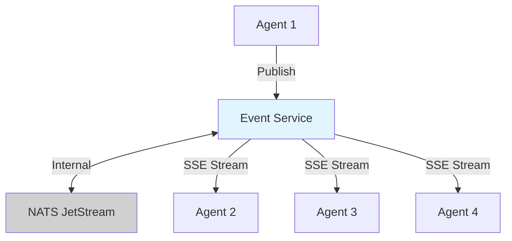
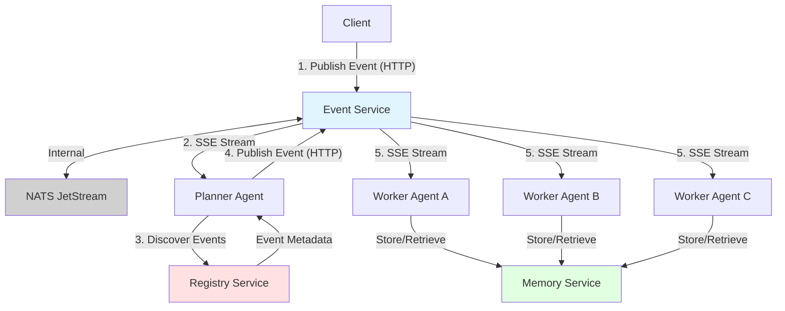
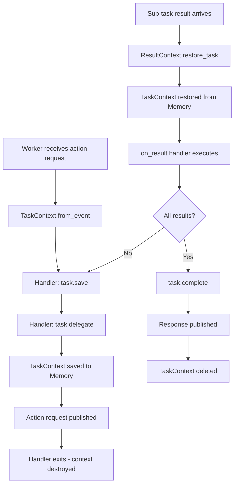

# Soorma Core Platform Architecture

**Context for AI Assistants (Copilot, Cursor):**
This document defines the platform architecture, services, and infrastructure of the `soorma-core` open-source repository.

**For Developer Experience:** See [docs/DEVELOPER_GUIDE.md](docs/DEVELOPER_GUIDE.md)  
**For Agent Patterns:** See [docs/agent_patterns/README.md](docs/agent_patterns/README.md)

---

## 1. What is Soorma?

Soorma is an **open-source platform for building AI agents** that work together through event-driven choreography. Instead of writing monolithic agent code, you compose systems of specialized agents that communicate through events.

### 1.1 The Repository
This repository (`soorma-core`) contains the **complete open-source foundation** for building AI agent systems:

| Component | Description |
| :--- | :--- |
| **SDK** | Python SDK for building agents (install from source: `pip install -e sdk/python`) |
| **Services** | Registry, Event Service, Memory Service, and Gateway microservices |
| **Libraries** | Common models and utilities |
| **Examples** | Working examples demonstrating patterns |
| **IaC** | Infrastructure as Code for self-hosting |

**License:** Everything in this repository is MIT licensed.

---

## 2. Platform Services

Soorma provides infrastructure services that connect agents through event-driven choreography.

### 2.1 Event Service (Message Bus)

* **Tech:** NATS JetStream with FastAPI proxy
* **Pattern:** Async Pub/Sub with "At-Least-Once" delivery
* **Role:** Choreography backbone - agents publish events, subscribe to topics
* **Features:** 
  - SSE streaming for real-time event consumption
  - Queue groups for load balancing
  - Topic-based routing
  - Persistent message storage (JetStream)
  - Support for request/response patterns with response_event routing
  - Distributed tracing with trace_id and parent_event_id

**Event Flow:**


**See also:** [Event System](./docs/event_system/README.md#messaging-patterns) for detailed queue/broadcast/load-balancing patterns.

### 2.2 Registry Service

* **Tech:** FastAPI + SQLite (dev) / PostgreSQL (prod)
* **Role:** Service Discovery and capability registration
* **Features:**
  - Agents register capabilities on startup
  - Events registered with rich metadata (description, purpose, schema)
  - Discovery API for finding available agents and events
  - TTL-based agent lifecycle tracking
  - Health checks and status monitoring

**Registration Flow:**
```python
from soorma import Worker
from soorma_common import EventDefinition, EventTopic

PROCESS_EVENT = EventDefinition(
    event_name="data.process.requested",
    topic=EventTopic.ACTION_REQUESTS,
    description="Request to process data",
    payload_schema={...}
)

worker = Worker(
    name="processor",
    events_consumed=[PROCESS_EVENT],
    events_produced=[...]
)
# SDK automatically registers agent and events
```

### 2.3 Memory Service

* **Tech:** PostgreSQL with pgvector extension (mandatory)
* **Role:** Unified persistent memory layer implementing CoALA framework
* **Memory Types:**
  - **Semantic Memory:** Factual knowledge (RAG with HNSW vector search)
  - **Episodic Memory:** User/Agent interaction history
  - **Procedural Memory:** Dynamic prompts and rules
  - **Working Memory:** Plan-scoped shared state (PostgreSQL-backed, Redis planned)

* **Security:**
  - Row Level Security (RLS) enforces tenant isolation
  - Session variables for policy enforcement
  - UUID primary keys prevent enumeration
  - ON DELETE CASCADE for automatic cleanup

* **Features:**
  - Internal embedding generation (OpenAI or local models)
  - HNSW indexes for sub-millisecond search
  - JSONB metadata storage
  - Multi-tenant architecture

**Memory API:**
```python
# Semantic Memory (knowledge storage)
await context.memory.store_knowledge(content, metadata)
results = await context.memory.search_knowledge(query, limit)

# Working Memory (workflow coordination)
await context.memory.store(key, value, plan_id)
value = await context.memory.retrieve(key, plan_id)

# Episodic Memory (conversation history)
await context.memory.log_interaction(agent_id, role, content, user_id)
history = await context.memory.get_recent_history(agent_id, user_id, limit)
```

See [docs/memory_system/README.md](docs/memory_system/README.md) for detailed usage patterns.

### 2.4 Gateway (Planned)

* **Tech:** FastAPI
* **Role:** Unified API gateway for all services
* **Features:**
  - Authentication and authorization
  - Rate limiting
  - Request routing
  - API versioning

---

## 3. Directory Structure

```text
soorma-core/                    # Open Source Repository (MIT)
├── sdk/
│   └── python/                 # The 'soorma-core' PyPI package
│       ├── soorma/             # SDK source code
│       │   ├── base.py         # Agent primitives (Planner, Worker, Tool)
│       │   ├── cli/            # 'soorma' command-line interface
│       │   ├── registry/       # Registry client
│       │   ├── ai/             # AI integration (EventToolkit)
│       │   └── context.py      # PlatformContext for agents
│       ├── tests/              # SDK test suite
│       ├── pyproject.toml      # Dependencies & metadata
│       └── CHANGELOG.md        # Version history
│
├── libs/
│   └── soorma-common/          # Shared Pydantic Models & DTOs
│       ├── src/soorma_common/
│       │   ├── models/         # Event, Agent, Capability models
│       │   └── enums/          # Shared enumerations
│       └── CHANGELOG.md
│
├── services/                   # Open Source Microservices
│   ├── registry/               # Agent & Event Registry
│   │   ├── src/app/            # FastAPI application
│   │   ├── alembic/            # Database migrations
│   │   ├── test/               # Service tests
│   │   └── docs/               # Service documentation
│   │
│   ├── event-service/          # Event Bus Proxy
│   │   ├── src/                # FastAPI + NATS adapter
│   │   └── test/               # Service tests
│   │
│   ├── memory/                 # Memory Service (state + embeddings)
│   │   ├── src/                # Memory service implementation
│   │   └── test/               # Memory service tests
│   └── gateway/                # API Gateway (planned)
│
├── examples/                   # Working Example Implementations
│   ├── README.md               # Complete learning path and catalog
│   ├── 01-hello-world/         # Basic Worker pattern
│   │   ├── README.md
│   │   ├── worker.py           # Simple event-handling worker
│   │   ├── client.py           # Example client
│   │   └── start.sh            # Launch script
│   │
│   ├── 02-events-simple/       # Pub/sub pattern
│   ├── 03-events-structured/   # Structured events with EventDefinition
│   │
│   └── research-advisor/       # Advanced autonomous choreography
│       ├── ARCHITECTURE.md     # Pattern deep dive
│       ├── README.md
│       ├── planner.py          # LLM-powered orchestrator
│       ├── researcher.py       # Web research worker
│       ├── advisor.py          # Content drafting worker
│       ├── validator.py        # Fact-checking worker
│       └── llm_utils.py        # Multi-provider LLM support
│
├── iac/                        # Infrastructure as Code
│   ├── docker-compose/         # Local development stacks
│   ├── terraform/              # Cloud deployment (planned)
│   └── helm/                   # Kubernetes charts (planned)
│
├── AGENT.md                    # AI assistant instructions
├── ARCHITECTURE.md             # This file
├── CHANGELOG.md                # Project-wide changes
└── README.md                   # Getting started guide
```

### 3.1 Coding Standards

* **Language:** Python 3.11+ minimum
* **Framework:** FastAPI (Services), Poetry (SDK)
* **Data Models:** All shared models use **Pydantic v2** in `libs/soorma-common`
* **Async:** All I/O operations (DB, HTTP, LLM) use `async/await`
* **Type Hints:** Required for all function signatures
* **Testing:** Pytest for all test suites
* **Linting:** Ruff for code quality

---

## 4. Event-Driven Architecture

### 4.1 Event Flow



### 4.2 Topics

Soorma uses **8 fixed topics** for routing events. Topics are stable, well-defined channels that organize event flow.

**See [docs/event_system/README.md](docs/event_system/README.md) for topics reference and event-driven patterns.**

### 4.3 Event Registration

Agents declare events they consume and produce using EventDefinition objects. The SDK automatically registers these with the Registry.

```python
from soorma_common import EventDefinition, EventTopic

PROCESS_EVENT = EventDefinition(
    event_name="data.process.requested",
    topic=EventTopic.ACTION_REQUESTS,
    description="Request to process data",
    payload_schema={...}  # Pydantic schema
)

worker = Worker(
    name="processor",
    events_consumed=[PROCESS_EVENT],
    events_produced=[...]
)
```

**See [docs/event_system/README.md](docs/event_system/README.md) for complete examples and patterns.**

### 4.4 Dynamic Discovery

Agents can discover available events at runtime from the Registry, enabling dynamic workflows and LLM-based event selection.

**See [docs/discovery/README.md](docs/discovery/README.md) for discovery API and examples.**

**See [docs/agent_patterns/README.md](docs/agent_patterns/README.md) for Autonomous Choreography pattern.**

---

## 5. Agent Models

Soorma provides three agent primitives for building AI agent systems. Each model serves a specific purpose in the distributed cognition architecture.

### 5.1 Tool Model (Synchronous)

**Purpose:** Stateless, synchronous operations that return immediate results.

**Characteristics:**
- Stateless: No persistence between invocations
- Synchronous: Handler returns result directly
- Auto-complete: SDK publishes response automatically
- Fast: No memory I/O, minimal latency

**Use Cases:**
- Calculations, data transformations
- API lookups, database queries
- Format conversions, validations
- Any operation that completes in < 1 second

**Example:**

```python
from soorma import Tool
from soorma.agents.tool import InvocationContext

tool = Tool(name="calculator")

@tool.on_invoke("calculate.add")
async def add_numbers(request: InvocationContext, context):
    numbers = request.data["numbers"]
    result = sum(numbers)
    return {"sum": result}  # Auto-published to response_event
```

**Topics:**
- Receives: `action-requests` (with event_type filter)
- Publishes: `action-results` (caller's response_event)

**See:** [examples/01-hello-tool](examples/01-hello-tool/) for complete example.

### 5.2 Worker Model (Asynchronous with Delegation)

**Purpose:** Stateful, asynchronous tasks with delegation and persistence.

**Characteristics:**
- Stateful: TaskContext persists across delegations
- Asynchronous: Manual completion with `task.complete()`
- Delegation: Can delegate to other Workers
- Resumable: State restored when results arrive

**Use Cases:**
- Multi-step workflows (book appointment → check availability → reserve slot)
- Long-running operations (data processing, analysis)
- Coordinated tasks (order processing with inventory + payment)
- Any operation requiring multiple async steps

**Example:**

```python
from soorma import Worker
from soorma.task_context import TaskContext, ResultContext

worker = Worker(name="booking-service")

@worker.on_task("book.appointment.requested")
async def book_appointment(task: TaskContext, context):
    # Save state
    task.state["appointment"] = task.data["appointment"]
    await task.save()
    
    # Delegate to availability service
    await task.delegate(
        event_type="check.availability.requested",
        data={"date": task.data["date"]},
        response_event="availability.checked",
    )
    # Handler pauses - execution resumes in on_result handler

@worker.on_result("availability.checked")
async def handle_availability(result: ResultContext, context):
    # Restore parent task
    task = await result.restore_task()
    
    if result.success:
        # Continue workflow
        await task.delegate(
            event_type="reserve.slot.requested",
            data={"slot_id": result.data["slot_id"]},
            response_event="slot.reserved",
        )
    else:
        await task.complete({"status": "unavailable"})

@worker.on_result("slot.reserved")
async def handle_reservation(result: ResultContext, context):
    task = await result.restore_task()
    await task.complete({
        "status": "booked",
        "confirmation": result.data["confirmation"]
    })
```

**Topics:**
- Receives: `action-requests` (task events), `action-results` (result events)
- Publishes: `action-results` (completion), `action-requests` (delegation)

**Delegation Patterns:**

1. **Sequential:** One sub-task at a time with `task.delegate()`
2. **Parallel:** Multiple sub-tasks with `task.delegate_parallel()`
3. **Multi-level:** Workers can delegate to Workers (arbitrary depth)

**See:** [examples/08-worker-basic](examples/08-worker-basic/) for complete example with parallel delegation.

### 5.3 Planner Model (Strategic Reasoning)

**Purpose:** Goal decomposition and task coordination using LLM reasoning.

**Characteristics:**
- Strategic: Reasons about goals and plans
- Adaptive: Adjusts plan based on results
- Coordinating: Assigns tasks to Workers
- Stateful: Plan state persists across steps

**Example:**

```python
from soorma import Planner
from soorma.agents.planner import Goal, Plan, Task

planner = Planner(name="research-coordinator")

@planner.on_goal("research.topic")
async def handle_research_goal(goal: Goal, context):
    topic = goal.data["topic"]
    
    # LLM-powered planning
    plan = await planner.reason_about_goal(goal, context)
    
    return Plan(
        goal=goal,
        tasks=[
            Task("search_papers", assigned_to="researcher"),
            Task("summarize", assigned_to="summarizer", depends_on=["search_papers"]),
            Task("draft_report", assigned_to="writer", depends_on=["summarize"]),
        ]
    )
```

**Note:** Full Planner implementation coming in Stage 4. See [docs/DESIGN_PATTERNS.md](docs/DESIGN_PATTERNS.md) for patterns.

### 5.4 Comparison Matrix

| Aspect | Tool | Worker | Planner |
|--------|------|--------|---------|
| **Execution** | Synchronous | Asynchronous | Asynchronous |
| **State** | Stateless | Stateful (TaskContext) | Stateful (Plan) |
| **Completion** | Auto (SDK) | Manual (`task.complete()`) | Manual (`plan.complete()`) |
| **Delegation** | ❌ No | ✅ Yes | ✅ Yes (via Tasks) |
| **Memory I/O** | ❌ No | ✅ Yes (task persistence) | ✅ Yes (plan state) |
| **Use Case** | Fast operations | Multi-step workflows | Goal decomposition |
| **Latency** | < 100ms | Seconds to minutes | Minutes to hours |
| **Example** | Calculator, Validator | Order processing | Research coordinator |

### 5.5 Response Event Pattern

All action requests include a `response_event` field that tells the responding agent what event type to publish when complete:

```python
# Requester (Tool or Worker)
await context.bus.request(
    event_type="process.data.requested",
    data={"input": "value"},
    response_event="process.data.completed",  # Tell responder what to publish
    correlation_id="req-123",
)

# Responder (Worker)
@worker.on_task("process.data.requested")
async def process_data(task: TaskContext, context):
    result = {"output": "processed"}
    await task.complete(result)  # Publishes to task.response_event
```

**Benefits:**
- No hardcoded response topic inference
- Caller controls response routing
- Supports dynamic workflows
- Enables result aggregation

### 5.6 TaskContext Lifecycle

The TaskContext enables async Workers to pause and resume execution:



**Key Points:**
1. TaskContext persists state across async boundaries
2. Sub-task correlation_id links results to parent task
3. Worker can delegate multiple times before completing
4. Memory Service provides transactional persistence

---

## 6. Deployment Options

### 6.1 Local Development

```bash
soorma dev --build  # Builds and starts all services in Docker
```

See [docs/DEVELOPER_GUIDE.md](docs/DEVELOPER_GUIDE.md) for complete development workflow.

### 6.2 Single Server Docker Compose (Planned)

```bash
cd iac/docker-compose
docker compose -f production.yml up -d
```

Services:
- Registry Service: Port 8000
- Memory Service: Port 8002
- Event Service: Port 8082
- NATS: Port 4222
- PostgreSQL: Port 5432

### 6.3 Kubernetes (Planned)

```bash
helm install soorma ./iac/helm/soorma-core
```

### 6.4 Cloud Managed (Planned)

Deploy to Soorma Cloud:
```bash
soorma deploy --target cloud
```

---

## 7. Contributing

We welcome contributions! See key areas:

### 7.1 Priority Areas

1. **SDK Enhancements:** New agent primitives, utilities
2. **Service Improvements:** Performance, reliability, features
3. **Examples:** New patterns, use cases, integrations
4. **Documentation:** Guides, tutorials, API docs
5. **Testing:** Increase coverage, add integration tests

### 7.2 Development Workflow

```bash
# Fork the repo and clone
git clone https://github.com/<your-username>/soorma-core.git
cd soorma-core

# Create a branch
git checkout -b feat/my-feature

# Make changes and test
pytest tests/ -v

# Commit with conventional commits
git commit -m "feat(sdk): add new capability"

# Push and create PR
git push origin feat/my-feature
```

See [docs/DEVELOPER_GUIDE.md](docs/DEVELOPER_GUIDE.md) for testing guidelines.

### 7.3 Code Review Checklist

- [ ] Tests pass (`pytest tests/ -v`)
- [ ] Code follows style guide (Ruff clean)
- [ ] CHANGELOG updated
- [ ] Documentation updated
- [ ] Backward compatible (or breaking change noted)
- [ ] Examples work (if applicable)

---

## 8. Roadmap

### Current
✅ Core SDK with Agent primitives

✅ Registry, Memory and Event Service

✅ Dynamic event discovery

✅ Autonomous choreography examples

✅ Multi-provider LLM support

✅ Circuit breakers and safety features

### Near Term
- [ ] State Tracker service
- [ ] Enhanced CLI (deployment, monitoring)
- [ ] More examples (code generation, data analysis)
- [ ] Performance optimizations

### Future
- [ ] Production-ready Kubernetes deployment
- [ ] Advanced observability (OpenTelemetry)
- [ ] Multi-language SDK support
- [ ] Marketplace for reusable agents
- [ ] SaaS management platform

---

## 9. Philosophy & Design Principles

### 9.1 Simplicity Over Complexity
Favor clear, simple solutions over clever, complex ones. Make common tasks easy.

### 9.2 Developer Experience First
Every decision prioritizes the developer using Soorma. Fast feedback loops, clear errors, excellent docs.

### 9.3 Autonomous Over Orchestrated
Agents should coordinate through events and reasoning, not hardcoded workflows.

### 9.4 Open Over Closed
Open source by default. Extensible. No lock-in. Standard protocols.

### 9.5 Production-Ready
Not just demos. Real reliability, observability, and scalability from day one.

---

**Related Documentation:**
- [Developer Guide](docs/DEVELOPER_GUIDE.md) - Developer experience and workflows
- [Agent Patterns](docs/agent_patterns/README.md) - Tool, Worker, Planner models and DisCo pattern
- [Event System](docs/event_system/README.md) - Event-driven architecture, topics, messaging
- [Memory System](docs/memory_system/README.md) - CoALA framework and memory types
- [Discovery](docs/discovery/README.md) - Registry and capability discovery
- [Examples](examples/) - Working implementations

**Getting Started:** See [README.md](README.md) for installation and quick start.

**AI Assistants:** See [AGENT.md](AGENT.md) for instructions on using this codebase with AI tools.
