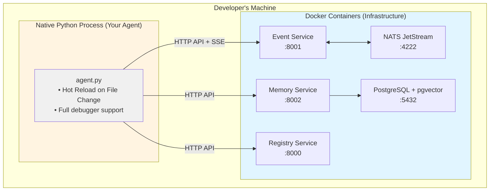
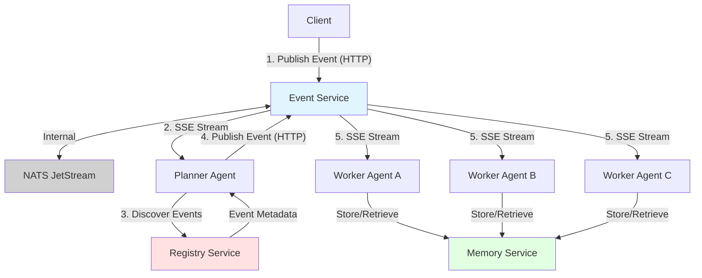

# Soorma Core Architecture & Developer Guide

**Context for AI Assistants (Copilot, Cursor):**
This document defines the architectural principles, directory structure, and design philosophy of the `soorma-core` open-source repository. Use this as the primary reference when developing agents, contributing to the platform, or understanding the system design.

---

## 1. What is Soorma?

Soorma is an **open-source platform for building AI agents** that work together through event-driven choreography. Instead of writing monolithic agent code, you compose systems of specialized agents that communicate through events.

### 1.1 The Repository
This repository (`soorma-core`) contains the **complete open-source foundation** for building AI agent systems:

| Component | Description |
| :--- | :--- |
| **SDK** | Python SDK for building agents (`pip install soorma-core`) |
| **Services** | Registry, Event Service, Memory Service, and Gateway microservices |
| **Libraries** | Common models and utilities |
| **Examples** | Working examples demonstrating patterns |
| **IaC** | Infrastructure as Code for self-hosting |

**License:** Everything in this repository is MIT licensed.

---

## 2. The DisCo Architecture (Distributed Cognition)

Soorma implements the **DisCo** pattern, enabling AI agents to coordinate through event-driven choreography rather than hardcoded workflows.

### 2.1 The "Trinity" of Agent Types

Developers using Soorma implement three types of agents:

1.  **Planner:** 
    - Strategic reasoning engine
    - Orchestrates workflows by reasoning about events
    - Discovers capabilities dynamically from the Registry
    - Uses LLM to decide next actions based on event metadata

2.  **Worker:** 
    - Domain-specific cognitive node (e.g., Researcher, Coder, Analyst)
    - Reacts to specific event types
    - Produces results as events for other agents
    - Stateless and autonomous

3.  **Tool:** 
    - Atomic, stateless capability (e.g., Calculator, API Search)
    - Extends agent capabilities with deterministic functions
    - Can be discovered and invoked dynamically

### 2.2 The "Nervous System" (Control Plane)

The platform provides infrastructure that connects agents:

#### Event Service (Bus)
* **Tech:** NATS JetStream with FastAPI proxy
* **Pattern:** Async Pub/Sub with "At-Least-Once" delivery
* **Role:** Choreography backbone - agents publish events, subscribe to topics
* **Features:** 
  - SSE streaming for real-time event consumption
  - Queue groups for load balancing
  - Topic-based routing

#### Registry Service
* **Tech:** FastAPI + SQLite (dev) / Postgres (prod)
* **Role:** Service Discovery and capability registration
* **Features:**
  - Agents register their capabilities on startup
  - Events are registered with rich metadata (description, purpose, schema)
  - Discovery API for finding available agents and events
  - TTL-based agent lifecycle tracking

#### Memory Service
* **Tech:** PostgreSQL with pgvector extension (mandatory - not SQLite compatible)
* **Role:** Unified persistent memory layer implementing CoALA (Cognitive Architectures for Language Agents) framework with enterprise multi-tenancy
* **Memory Types:**
  - **Semantic Memory:** Factual knowledge shared across tenant (RAG with HNSW vector search)
  - **Episodic Memory:** User/Agent interaction history with temporal recall
  - **Procedural Memory:** Dynamic prompts, rules, and few-shot examples
  - **Working Memory:** Plan-scoped shared state for multi-agent collaboration
* **Security:**
  - Row Level Security (RLS) enforces tenant isolation at database level
  - Session variables (`app.current_tenant`, `app.current_user`) for policy enforcement
  - UUID primary keys prevent enumeration attacks
  - ON DELETE CASCADE for automatic data cleanup
* **Features:**
  - Internal embedding generation (OpenAI text-embedding-3-small or local models)
  - HNSW indexes for sub-millisecond semantic search at scale
  - JSONB metadata storage for flexible context
  - Tenant/User replica tables synced from Identity Service for referential integrity
* **Integration:** Accessed by Planners and Workers via HTTP API or SDK client. Local development uses Docker PostgreSQL with pgvector; production supports managed PostgreSQL instances.

### 2.3 Autonomous Choreography (Key Innovation)

Traditional agent systems hardcode workflow logic: "after step A, do step B." This is brittle.

**Soorma's Approach:**
1. **Registration:** Agents register events they consume/produce with the Registry
2. **Discovery:** Planner queries Registry to find available events at runtime
3. **Reasoning:** LLM analyzes event metadata (descriptions, purposes, schemas)
4. **Decision:** LLM selects the appropriate event and constructs the payload
5. **Execution:** Event is published, triggering the next agent in the workflow

**Result:** Workflows emerge from agent decisions, not predefined sequences.

**Benefits:**
- Add new agents without changing orchestration code
- Agents adapt to available capabilities dynamically
- LLM reasons about best path based on context
- No hardcoded workflow rules to maintain

**Example:** See `examples/research-advisor/` for a complete implementation.

---

## 3. Directory Structure

```text
soorma-core/                    # Open Source Repository (MIT)
├── sdk/
│   └── python/                 # The 'soorma-core' PyPI package
│       ├── soorma/             # SDK source code
│       │   ├── base.py         # Agent primitives (Planner, Worker, Tool)
│       │   ├── cli/            # 'soorma' command-line interface
│       │   ├── registry/       # Registry client
│       │   ├── ai/             # AI integration (EventToolkit)
│       │   └── context.py      # PlatformContext for agents
│       ├── tests/              # SDK test suite
│       ├── pyproject.toml      # Dependencies & metadata
│       └── CHANGELOG.md        # Version history
│
├── libs/
│   └── soorma-common/          # Shared Pydantic Models & DTOs
│       ├── src/soorma_common/
│       │   ├── models/         # Event, Agent, Capability models
│       │   └── enums/          # Shared enumerations
│       └── CHANGELOG.md
│
├── services/                   # Open Source Microservices
│   ├── registry/               # Agent & Event Registry
│   │   ├── src/app/            # FastAPI application
│   │   ├── alembic/            # Database migrations
│   │   ├── test/               # Service tests
│   │   └── docs/               # Service documentation
│   │
│   ├── event-service/          # Event Bus Proxy
│   │   ├── src/                # FastAPI + NATS adapter
│   │   └── test/               # Service tests
│   │
│   ├── memory/                 # Memory Service (state + embeddings)
│   │   ├── src/                # Memory service implementation
│   │   └── test/               # Memory service tests
│   └── gateway/                # API Gateway (planned)
│
├── examples/                   # Working Example Implementations
│   ├── hello-world/            # Basic agent example
│   │   ├── README.md
│   │   └── *.py                # Agent implementations
│   │
│   └── research-advisor/       # Advanced autonomous choreography
│       ├── ARCHITECTURE.md     # Pattern deep dive
│       ├── README.md
│       ├── planner.py          # LLM-powered orchestrator
│       ├── researcher.py       # Web research worker
│       ├── advisor.py          # Content drafting worker
│       ├── validator.py        # Fact-checking worker
│       └── llm_utils.py        # Multi-provider LLM support
│
├── iac/                        # Infrastructure as Code
│   ├── docker-compose/         # Local development stacks
│   ├── terraform/              # Cloud deployment (planned)
│   └── helm/                   # Kubernetes charts (planned)
│
├── AGENT.md                    # AI assistant instructions
├── ARCHITECTURE.md             # This file
├── CHANGELOG.md                # Project-wide changes
└── README.md                   # Getting started guide
```

### 3.1 Coding Standards

* **Language:** Python 3.11+ minimum
* **Framework:** FastAPI (Services), Poetry (SDK)
* **Data Models:** All shared models use **Pydantic v2** in `libs/soorma-common`
* **Async:** All I/O operations (DB, HTTP, LLM) use `async/await`
* **Type Hints:** Required for all function signatures
* **Testing:** Pytest for all test suites
* **Linting:** Ruff for code quality

---

## 4. Developer Experience (DX)

We optimize for three user journeys:

### 4.1 The Solo Creator (Zero to Agent)

**Install:** `pip install soorma-core`

**CLI:** The `soorma` command is bundled in the SDK.

| Command | Description |
|---------|-------------|
| `soorma dev --build` | Builds local infrastructure (Registry + NATS + Memory + Event Service) |
| `soorma init <name>` | Scaffolds a new agent project with boilerplate |
| `soorma deploy` | Deploys to Soorma Cloud (planned) |

**Typical Workflow:**
```bash
# 1. Install the SDK
pip install soorma-core

# 2. Build local infrastructure
export OPENAI_API_KEY=your_key_here
soorma dev --build

# 3. Create a new agent project
soorma init my-agent
cd my-agent

# 4. Your agent code runs natively, connects to Docker services
python agent.py
```

#### The "Infra in Docker, Code on Host" Pattern

`soorma dev` implements a **hybrid execution model** for fast iteration:



**Why this pattern?**
1. **Fast Iteration:** Change `agent.py`, save, instant effect. No `docker build` cycle.
2. **Debuggability:** Attach debugger directly to your agent code.
3. **Production Parity:** Infrastructure is containerized, identical to production.
4. **No Port Conflicts:** Services use standard ports (8000, 8001, 4222).

**How it works:**

1. **`soorma dev` starts Docker Compose stack:**
   ```bash
   docker compose -f ~/.soorma/docker-compose.yml up -d
   ```

2. **Your agent runs natively with environment variables:**
   ```bash
   export SOORMA_REGISTRY_URL="http://localhost:8081"
   export SOORMA_EVENT_SERVICE_URL="http://localhost:8082"
   export SOORMA_MEMORY_SERVICE_URL="http://localhost:8083"
   python agent.py
   ```

3. **Services are production-ready running on local docker:**
   - Registry Service: Agent and Event registry
   - NATS: JetStream message bus for reliable event delivery
   - Event Service: Proxy to NATS with SSE support
   - Memory Service: PostgreSQL with pgvector for semantic memory
   - PostgreSQL: Persistent database for services

### 4.2 The Integration Developer

* Integrates `soorma-core` into existing Python applications
* Uses the SDK programmatically without the CLI
* Offloads cognitive tasks to Soorma agents
* Connects to existing infrastructure

**Example:**
```python
from soorma import Worker
from soorma.context import PlatformContext

# Create a worker agent
worker = Worker(
    name="data-processor",
    description="Processes data events",
    capabilities=["data-processing"]
)

@worker.on_event("data.received")
async def process_data(event: dict, context: PlatformContext):
    # Your processing logic
    await context.bus.publish(
        event_type="data.processed",
        topic="results",
        data={"result": "..."}
    )

# Run the worker
worker.run()
```

### 4.3 The Self-Hoster

* Deploys the full platform to their own infrastructure
* Uses Docker Compose for simple deployments
* Kubernetes/Helm for production (planned)
* Full control over data and infrastructure

**Deploy with Docker Compose:**
```bash
cd iac/docker-compose
docker compose -f production.yml up -d
```

**Deploy to Kubernetes (planned):**
```bash
cd iac/helm
helm install soorma ./soorma-core
```

---

## 5. Event-Driven Patterns

### 5.1 Event Flow



### 5.2 Event Registration

When an agent starts, it registers events with the Registry:

```python
from soorma import Worker
from soorma.models import EventDefinition

PROCESS_EVENT = EventDefinition(
    event_name="data.process.requested",
    description="Request to process data",
    purpose="Analyze and transform input data",
    topic="action-requests",
    payload_schema={...}
)

worker = Worker(
    name="processor",
    events_consumed=[PROCESS_EVENT],
    events_produced=[...]
)
```

### 5.3 Dynamic Discovery

The Planner discovers events at runtime:

```python
from soorma.ai.event_toolkit import EventToolkit

async with EventToolkit(registry_url) as toolkit:
    # Discover all actionable events
    events = await toolkit.discover_actionable_events(
        topic="action-requests"
    )
    
    # Returns: [{name, description, purpose, schema}, ...]
```

### 5.4 LLM-Driven Decisions

The Planner uses LLM to reason about events:

```python
prompt = f"""
Available Events:
{format_events(events)}

Current State:
{workflow_state}

Decide the next action to progress toward the goal.
"""

response = await llm.reason(prompt)
# LLM returns: {"event": "data.process.requested", "payload": {...}}
```

---

## 6. Multi-Provider LLM Support

Soorma examples demonstrate provider-agnostic LLM integration via LiteLLM:

**Supported Providers:**
- OpenAI (GPT-4, GPT-4o, etc.)
- Anthropic (Claude 3, etc.)
- Google (Gemini)
- Azure OpenAI
- Together AI
- Groq
- Any LiteLLM-compatible provider

**Pattern:**
```python
from llm_utils import get_llm_model, has_any_llm_key

if has_any_llm_key():
    model = get_llm_model()  # Auto-detects from env vars
    response = completion(model=model, messages=[...])
```

See `examples/research-advisor/llm_utils.py` for implementation.

---

## 7. Testing Strategy

### 7.1 SDK Tests

```bash
cd sdk/python
pytest tests/ -v

# Run specific test file
pytest tests/test_registry_client.py -v

# With coverage
pytest tests/ --cov=soorma --cov-report=html
```

### 7.2 Service Tests

```bash
cd services/registry
pytest test/ -v

cd services/event-service
pytest test/ -v
```

### 7.3 Integration Tests

Test agents with real services:
```python
@pytest.fixture
async def test_stack():
    """Start test stack with Docker."""
    subprocess.run(["soorma", "dev"], check=True)
    yield
    # Cleanup
```

### 7.4 Example Tests

Examples should be executable and tested:
```bash
cd examples/research-advisor
python -m pytest test_planner.py -v
```

---

## 8. Circuit Breakers & Safety

Autonomous systems need safeguards. Soorma implements circuit breakers:

### 8.1 Action Limits

Prevent infinite loops:
```python
MAX_TOTAL_ACTIONS = 10

if len(action_history) >= MAX_TOTAL_ACTIONS:
    return force_completion()
```

### 8.2 Vague Result Detection

Catch when LLM returns meta-descriptions instead of content:
```python
vague_indicators = ["draft is ready", "already prepared"]
if any(indicator in result.lower() for indicator in vague_indicators):
    result = workflow_state["draft"]["draft_text"]  # Use actual content
```

### 8.3 Timeout Handling (Planned)

Future Tracker service will:
- Detect stalled workflows
- Retry failed events
- Enable human intervention
- Provide observability dashboards

---

## 9. Deployment Options

### 9.1 Local Development

```bash
soorma dev --build # Build and starts all services in Docker
```

### 9.2 Single Server Docker Compose (Planned)

```bash
cd iac/docker-compose
docker compose -f production.yml up -d
```

Services:
- Registry Service: Port 8000
- Memory Service: Port 8002
- Event Service: Port 8082
- NATS: Port 4222
- Postgres: Port 5432 (optional)

### 9.3 Kubernetes (Planned)

```bash
helm install soorma ./iac/helm/soorma-core
```

### 9.4 Cloud Managed (Planned)

Deploy to Soorma Cloud:
```bash
soorma deploy --target cloud
```

---

## 10. Contributing

We welcome contributions! See key areas:

### 10.1 Priority Areas

1. **SDK Enhancements:** New agent primitives, utilities
2. **Service Improvements:** Performance, reliability, features
3. **Examples:** New patterns, use cases, integrations
4. **Documentation:** Guides, tutorials, API docs
5. **Testing:** Increase coverage, add integration tests

### 10.2 Development Workflow

```bash
# Fork the repo and clone
git clone https://github.com/<your-username>/soorma-core.git
cd soorma-core

# Create a branch
git checkout -b feat/my-feature

# Make changes and test
pytest tests/ -v

# Commit with conventional commits
git commit -m "feat(sdk): add new capability"

# Push and create PR
git push origin feat/my-feature
```

### 10.3 Code Review Checklist

- [ ] Tests pass (`pytest tests/ -v`)
- [ ] Code follows style guide (Ruff clean)
- [ ] CHANGELOG updated
- [ ] Documentation updated
- [ ] Backward compatible (or breaking change noted)
- [ ] Examples work (if applicable)

---

## 11. Roadmap

### Current
✅ Core SDK with Agent primitives

✅ Registry, Memory and Event Service

✅ Dynamic event discovery

✅ Autonomous choreography examples

✅ Multi-provider LLM support

✅ Circuit breakers and safety features

### Near Term
- [ ] State Tracker service
- [ ] Enhanced CLI (deployment, monitoring)
- [ ] More examples (code generation, data analysis)
- [ ] Performance optimizations

### Future
- [ ] Production-ready Kubernetes deployment
- [ ] Advanced observability (OpenTelemetry)
- [ ] Multi-language SDK support
- [ ] Marketplace for reusable agents
- [ ] SaaS management platform

---

## 12. Philosophy & Design Principles

### 12.1 Simplicity Over Complexity
Favor clear, simple solutions over clever, complex ones. Make common tasks easy.

### 12.2 Developer Experience First
Every decision prioritizes the developer using Soorma. Fast feedback loops, clear errors, excellent docs.

### 12.3 Autonomous Over Orchestrated
Agents should coordinate through events and reasoning, not hardcoded workflows.

### 12.4 Open Over Closed
Open source by default. Extensible. No lock-in. Standard protocols.

### 12.5 Production-Ready
Not just demos. Real reliability, observability, and scalability from day one.

---

**Questions?** Check `AGENT.md` for AI assistant instructions or `README.md` for getting started.

**Examples?** See `examples/research-advisor/` for advanced patterns in action.

**Contributing?** We'd love your help! See section 10 above.
