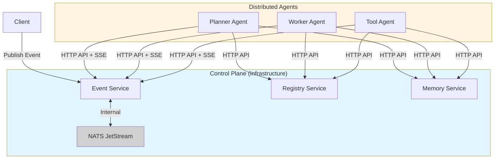

<div align="center">
  <h1>Soorma Core</h1>
  <h3>The Open Source Foundation for AI Agents</h3>
  
  <p>
    <b>Battle-tested. Self-hostable. Enterprise-grade.</b>
  </p>

  <br />

  <a href="https://pypi.org/project/soorma-core/">
    
  </a>
  <a href="https://ghcr.io/soorma-ai/gateway">
    
  </a>
  <a href="https://soorma.ai">
    
  </a>

  <br />
  <br />
</div>

## 🛡️ Mission

Soorma is an agentic infrastructure platform based on the **DisCo (Distributed Cognition)** architecture. It solves the fragmentation in the AI agent ecosystem by providing a standardized **Control Plane** (Gateway, Registry, State, Pub/Sub) that allows distinct cognitive entities to discover each other and collaborate.

We believe the future of AI infrastructure must be:
1.  **Distributed:** Agents should be long-lived services, not single-threaded loops.
2.  **Self-Hostable:** You should own your data and your agent's reasoning logs.
3.  **Model Agnostic:** Orchestrate agents across OpenAI, Anthropic, Mistral, or local Llama instances.

## 🏗️ Architecture

Soorma replaces the fragile "Orchestration" pattern (central control) with **Choreography** (event-driven flow).



## Prerequisites

- **Python 3.11+** (for SDK and local development)
- **Docker & Docker Compose** (for running infrastructure)

## ⚡ Quick Start

> **Note:** Docker images are not yet published to GHCR. You must build them locally first.

### 1. Clone Repository and Build Infrastructure

```bash
# Clone the repository (needed for Docker images)
git clone https://github.com/soorma-ai/soorma-core.git
cd soorma-core

# Create and activate virtual environment
python -m venv .venv
source .venv/bin/activate  # On Windows: .venv\Scripts\activate

# Install the SDK from PyPI
pip install soorma-core

# Build infrastructure containers (required first time)
soorma dev --build
```

> 💡 **Alternative:** To install SDK from local source (for development/customization):
> ```bash
> pip install -e sdk/python
> ```

### 2. Run the Hello World Example

The fastest way to see Soorma in action:

```bash
# Start infrastructure (Registry, NATS, Event Service, Memory Service, PostgreSQL)
soorma dev

# Run the example (one command):
cd examples/hello-world
bash start.sh  # Uses "World" by default
# Or
bash start.sh "Alice"  # Custom name
```

Or run agents manually in separate terminals:
```bash
python examples/hello-world/planner_agent.py
python examples/hello-world/worker_agent.py
python examples/hello-world/tool_agent.py
python examples/hello-world/client.py
```

See the [Hello World Example](./examples/hello-world/README.md) for full details.

### 3. Create Your Own Agent

```bash
# Scaffold a new agent project
soorma init my-agent --type worker

cd my-agent
python -m venv .venv
source .venv/bin/activate
pip install -e ".[dev]"

# Start infrastructure
soorma dev

# In another terminal, run your agent
python -m my_agent.agent
```

### 📖 More Examples

- **[Hello World](./examples/hello-world/README.md)**: A simple introduction to the **DisCo Trinity** pattern (Planner → Worker → Tool).
- **[Research Advisor](./examples/research-advisor/README.md)**: An advanced example demonstrating **Dynamic Choreography**, where a Planner agent dynamically discovers and orchestrates Researcher, Drafter, and Validator agents to solve complex multi-step problems.

### 🔧 CLI Reference

For detailed CLI commands (`soorma init`, `soorma dev`, `soorma deploy`), see the [SDK Documentation](./sdk/python/README.md#cli-commands).

## 📦 Components

| Service | Description | Status |
| :--- | :--- | :--- |
| **Gateway** | API Gateway & SSE Entrypoint | 🟡 Preview |
| **Registry** | Service Discovery for Agents | 🟢 v0.5.0 |
| **Event Service** | SSE Event Bus for Agent Choreography | 🟢 v0.5.0 |
| **Tracker** | Distributed State Machine | ⚪ Planned |
| **Memory** | Vector & Semantic Memory Store (CoALA) | 🟢 v0.5.0 |

## 🤝 Contributing

We are currently in **Day 0 (Pre-Alpha)**. The codebase is being actively scaffolded.
Join the [Waitlist](https://soorma.ai) to be notified when the first "Good First Issue" drops.

---
<div align="center">
  <sub>© 2025 Soorma AI. Built for the brave.</sub>
</div>