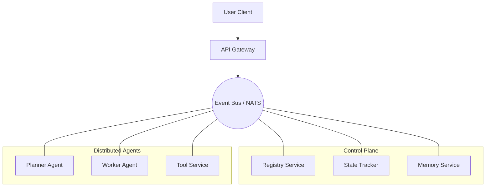

<div align="center">
  <h1>Soorma Core</h1>
  <h3>The Open Source Foundation for AI Agents</h3>
  
  <p>
    <b>Battle-tested. Self-hostable. Enterprise-grade.</b>
  </p>

  <br />

  <a href="https://pypi.org/project/soorma-core/">
    
  </a>
  <a href="https://ghcr.io/soorma-ai/gateway">
    
  </a>
  <a href="https://soorma.ai">
    
  </a>

  <br />
  <br />
</div>

## 🛡️ Mission

Soorma is an agentic infrastructure platform based on the **DisCo (Distributed Cognition)** architecture. It solves the fragmentation in the AI agent ecosystem by providing a standardized **Control Plane** (Gateway, Registry, State, Pub/Sub) that allows distinct cognitive entities to discover each other and collaborate.

We believe the future of AI infrastructure must be:
1.  **Distributed:** Agents should be long-lived services, not single-threaded loops.
2.  **Self-Hostable:** You should own your data and your agent's reasoning logs.
3.  **Model Agnostic:** Orchestrate agents across OpenAI, Anthropic, Mistral, or local Llama instances.

## 🏗️ Architecture

Soorma replaces the fragile "Orchestration" pattern (central control) with **Choreography** (event-driven flow).



## ⚡ Quick Start

### 1. Install the SDK
```bash
pip install soorma-core
```

### 2. Define a Worker
The **DisCo** architecture separates logic (`Worker`) from plumbing (`soorma`).

```python
from soorma import Worker

# Define a long-lived, event-driven worker
analyst = Worker(name="MarketAnalyst", capabilities=["analyze_trends"])

@analyst.on_event("research.requested")
async def handle(event, context):
    # 1. Access Shared Memory
    history = await context.memory.retrieve(tags=["Q3"])
    
    # 2. Perform Logic (LangChain, AutoGen, or Raw Python)
    result = perform_analysis(event.data, history)
    
    # 3. Publish Result
    return {"analysis": result}
```

### 3. Run Locally
```bash
# Spins up the local Control Plane (Gateway, Registry, NATS)
soorma dev
```

## 📦 Components

| Service | Description | Status |
| :--- | :--- | :--- |
| **Gateway** | API Gateway & WebSocket Entrypoint | 🟡 Preview |
| **Registry** | Service Discovery for Agents | 🟡 Preview |
| **Tracker** | Distributed State Machine | 🟡 Preview |
| **Memory** | Vector & Semantic Memory Store | ⚪ Planned |

## 🤝 Contributing

We are currently in **Day 0 (Pre-Alpha)**. The codebase is being actively scaffolded.
Join the [Waitlist](https://soorma.ai) to be notified when the first "Good First Issue" drops.

---
<div align="center">
  <sub>© 2025 Soorma AI. Built for the brave.</sub>
</div>