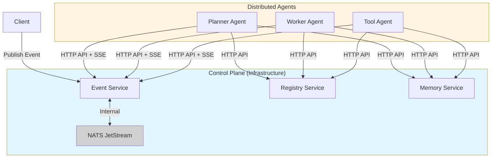

<div align="center">
  <h1>Soorma Core</h1>
  <h3>The Open Source Foundation for AI Agents</h3>
  
  <p>
    <b>Battle-tested. Self-hostable. Enterprise-grade.</b>
  </p>

  <br />

  <a href="https://pypi.org/project/soorma-core/">
    
  </a>
  <a href="https://ghcr.io/soorma-ai/gateway">
    
  </a>
  <a href="https://soorma.ai">
    
  </a>

  <br />
  <br />
</div>

---

> **📋 Refactoring in Progress**  
> Soorma Core is undergoing a pre-launch refactoring to solidify architecture and SDK design.  
> See [docs/refactoring/README.md](docs/refactoring/README.md) for details and status.  
> - Stage 1 (Foundation - Event System) ✅ Complete (v0.6.0)
> - Stage 2 (Foundation - Memory & Common DTOs) ✅ Complete (v0.7.0)
> - Stage 3 (Agent Models - Tool & Worker) ✅ Complete (v0.7.7) - Tests, docs, validation done
>
> **⚠️ Install from source during pre-launch:** Use `pip install -e sdk/python` to stay synchronized with breaking changes.

---

## 🛡️ Mission

Soorma is an agentic infrastructure platform based on the **DisCo (Distributed Cognition)** architecture. It solves the fragmentation in the AI agent ecosystem by providing a standardized **Control Plane** (Gateway, Registry, State, Pub/Sub) that allows distinct cognitive entities to discover each other and collaborate.

We believe the future of AI infrastructure must be:
1.  **Distributed:** Agents should be long-lived services, not single-threaded loops.
2.  **Self-Hostable:** You should own your data and your agent's reasoning logs.
3.  **Model Agnostic:** Orchestrate agents across OpenAI, Anthropic, Mistral, or local Llama instances.

## 🏗️ Architecture

Soorma replaces the fragile "Orchestration" pattern (central control) with **Choreography** (event-driven flow).



## Prerequisites

- **Python 3.11+** (for SDK and local development)
- **Docker & Docker Compose** (for running infrastructure)

## ⚡ Quick Start

> **Note:** Docker images are not yet published to GHCR. You must build them locally first.

### 1. Clone Repository and Build Infrastructure

```bash
# Clone the repository (needed for Docker images)
git clone https://github.com/soorma-ai/soorma-core.git
cd soorma-core

# Create and activate virtual environment
python -m venv .venv
source .venv/bin/activate  # On Windows: .venv\Scripts\activate

# Install the SDK from local source (recommended during pre-launch)
pip install -e sdk/python

# Build infrastructure containers (required first time)
soorma dev --build
```

> 💡 **Why local source?** During pre-launch with active development and breaking changes, installing from source ensures your SDK stays synchronized with the latest infrastructure when you pull updates. Once v1.0 is released, we'll recommend PyPI installation (`pip install soorma-core`).

### 2. Run the Hello World Example

The fastest way to see Soorma in action:

```bash
# Terminal 1: Start infrastructure (Registry, NATS, Event Service, Memory Service, PostgreSQL)
soorma dev

# Terminal 2: Start the worker
cd examples/01-hello-world
bash start.sh

# Terminal 3: Send a request
python client.py Alice
```

See the [Hello World Example](./examples/01-hello-world/README.md) for full details.

**More Examples:**
- [01-hello-tool](./examples/01-hello-tool/) - Synchronous Tool pattern (stateless calculator)
- [08-worker-basic](./examples/08-worker-basic/) - Async Worker with parallel delegation (order processing)
- [research-advisor](./examples/research-advisor/) - Advanced autonomous choreography

**Full catalog:** See [examples/README.md](./examples/README.md) for complete learning path.

### 3. Create Your Own Agent

```bash
# Scaffold a new agent project
soorma init my-agent --type worker

cd my-agent
python -m venv .venv
source .venv/bin/activate
pip install -e ".[dev]"

# Implement your agent logic (use examples with Copilot/Cursor)
# See docs/AI_ASSISTANT_GUIDE.md for AI-assisted development patterns

# Start infrastructure
soorma dev

# In another terminal, run your agent
python -m my_agent.agent
```

### 📖 More Examples

See the **[Examples Guide](./examples/README.md)** for a complete catalog of examples with a progressive learning path.

## 📚 Documentation

### Core Documentation
- **[Architecture](./ARCHITECTURE.md)** - Platform services, event architecture, deployment options
- **[Developer Guide](./docs/DEVELOPER_GUIDE.md)** - DX workflows, testing, debugging, multi-provider LLM support
- **[AI Assistant Guide](./docs/AI_ASSISTANT_GUIDE.md)** - Using examples with Copilot/Cursor for rapid development
- **[Examples Guide](./examples/README.md)** - Progressive learning path and pattern catalog

### Feature-Specific Guides
- **[Agent Patterns](./docs/agent_patterns/README.md)** - Tool, Worker, Planner models and DisCo pattern
- **[Event System](./docs/event_system/README.md)** - Event-driven architecture, topics, messaging patterns
- **[Memory System](./docs/memory_system/README.md)** - CoALA framework (Semantic, Working, Episodic, Procedural)
- **[Discovery](./docs/discovery/README.md)** - Registry Service and capability-based discovery

### 🔧 CLI Reference

For detailed CLI commands (`soorma init`, `soorma dev`, `soorma deploy`), see the [SDK Documentation](./sdk/python/README.md#cli-commands).

## 📦 Components

| Service | Description | Status |
| :--- | :--- | :--- |
| **Gateway** | API Gateway & SSE Entrypoint | 🟡 Preview |
| **Registry** | Service Discovery for Agents | 🟢 Available |
| **Event Service** | SSE Event Bus for Agent Choreography | 🟢 Available |
| **Tracker** | Distributed State Machine | ⚪ Planned |
| **Memory** | Vector & Semantic Memory Store (CoALA) | 🟢 Available |

## 🤝 Contributing

We are currently in **Day 0 (Pre-Alpha)**. The codebase is being actively scaffolded.
Join the [Waitlist](https://soorma.ai) to be notified when the first "Good First Issue" drops.

### For Core Contributors & AI-Assisted Development

If you're contributing to soorma-core itself:

1. **Read the Constitution:** [AGENT.md](AGENT.md) - Core developer requirements
2. **Use TDD Session Template:** [docs/SESSION_INITIALIZATION.md](docs/SESSION_INITIALIZATION.md) - **MANDATORY** for all implementation sessions
3. **Follow Architecture Patterns:** [docs/ARCHITECTURE_PATTERNS.md](docs/ARCHITECTURE_PATTERNS.md) - SDK design requirements

**Why the session template?** It enforces test-driven development (TDD) and prevents common violations like implementation-before-tests. **Every session must start with this template.**

---
<div align="center">
  <sub>© 2025 Soorma AI. Built for the brave.</sub>
</div>