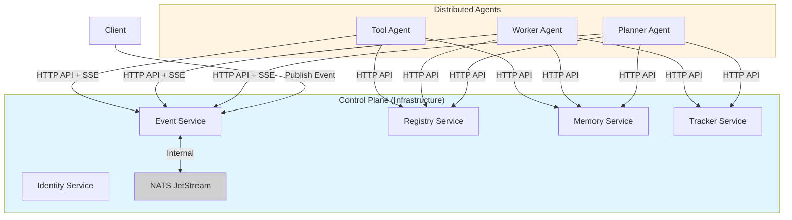

<div align="center">
  <h1>Soorma Core</h1>
  <h3>The Open Source Foundation for AI Agents</h3>
  
  <p>
    <b>Battle-tested. Self-hostable. Enterprise-grade.</b>
  </p>

  <br />

  <a href="https://pypi.org/project/soorma-core/">
    
  </a>
  <a href="https://ghcr.io/soorma-ai/gateway">
    
  </a>
  <a href="https://soorma.ai">
    
  </a>

  <br />
  <br />
</div>

---

> **📋 Refactoring in Progress**  
> Soorma Core is undergoing a pre-launch refactoring to solidify architecture and SDK design.  
> See [docs/refactoring/README.md](docs/refactoring/README.md) for details and status.  
> - Stage 1 (Foundation - Event System) ✅ Complete (v0.6.0)
> - Stage 2 (Foundation - Memory & Common DTOs) ✅ Complete (v0.7.0)
> - Stage 3 (Agent Models - Tool & Worker) ✅ Complete (v0.7.7)
> - Stage 4 (Agent Models - Planner & ChoreographyPlanner) ✅ Complete (v0.8.0)
> - Stage 5 (Discovery, A2A, and Tracker infrastructure split) ✅ Complete (v0.8.2 → aligned in v0.9.0)
>
> **⚠️ Install from source during pre-launch:** Use `pip install -e sdk/python` to stay synchronized with breaking changes.

---

## 🛡️ Mission

Soorma is an agentic infrastructure platform based on the **DisCo (Distributed Cognition)** architecture. It solves fragmentation in the AI agent ecosystem by providing a standardized control plane built around Registry, Event, Memory, Tracker, Identity, and messaging infrastructure so distinct cognitive entities can discover each other and collaborate.

We believe the future of AI infrastructure must be:
1.  **Distributed:** Agents should be long-lived services, not single-threaded loops.
2.  **Self-Hostable:** You should own your data and your agent's reasoning logs.
3.  **Model Agnostic:** Orchestrate agents across OpenAI, Anthropic, Mistral, or local Llama instances.

## 🏗️ Architecture

Soorma replaces the fragile "Orchestration" pattern (central control) with **Choreography** (event-driven flow).


```mermaid
graph TB
    Client[Client] -->|Publish Event| EventService
    
    subgraph ControlPlane["Control Plane (Infrastructure)"]
        Registry[Registry Service]
        EventService[Event Service]
        Memory[Memory Service]
        Tracker[Tracker Service]
        Identity[Identity Service]
        NATS[NATS JetStream]
        
        EventService <-->|Internal| NATS
    end
    
    subgraph DistributedAgents["Distributed Agents"]
        Planner[Planner Agent]
        Worker[Worker Agent]
        Tool[Tool Agent]
    end
    
    %% Agent connections to Control Plane
    Planner -->|HTTP API| Registry
    Planner -->|HTTP API + SSE| EventService
    Planner -->|HTTP API| Memory
    Planner -->|HTTP API| Tracker
    
    Worker -->|HTTP API| Registry
    Worker -->|HTTP API + SSE| EventService
    Worker -->|HTTP API| Memory
    Worker -->|HTTP API| Tracker
    
    Tool -->|HTTP API| Registry
    Tool -->|HTTP API + SSE| EventService
    Tool -->|HTTP API| Memory
    
    style ControlPlane fill:#e1f5ff
    style DistributedAgents fill:#fff4e1
    style NATS fill:#d0d0d0
```

## Prerequisites

- **Python 3.11+** (for SDK and local development)
- **Docker & Docker Compose** (for running infrastructure)

## ⚡ Quick Start

> **Note:** Docker images are not yet published to GHCR. You must build them locally first.

### 1. Clone Repository and Build Infrastructure

```bash
# Clone the repository (needed for Docker images)
git clone https://github.com/soorma-ai/soorma-core.git
cd soorma-core

# Create and activate virtual environment
python -m venv .venv
source .venv/bin/activate  # On Windows: .venv\Scripts\activate

# Install the SDK from local source (recommended during pre-launch)
pip install -e sdk/python

# Build infrastructure containers (required first time)
soorma dev --build
```

> 💡 **Why local source?** During pre-launch with active development and breaking changes, installing from source ensures your SDK stays synchronized with the latest infrastructure when you pull updates. Once v1.0 is released, we'll recommend PyPI installation (`pip install soorma-core`).

### 2. Run the Hello World Example

The fastest way to see Soorma in action:

```bash
# Terminal 1: Start infrastructure (Registry, Event, Memory, Tracker, Identity, NATS, PostgreSQL)
soorma dev --build

# Terminal 2: Start the worker
cd examples/01-hello-world
bash start.sh

# Terminal 3: Send a request
python client.py Alice
```

See the [Hello World Example](./examples/01-hello-world/README.md) for full details.

**More Examples:**
- [01-hello-tool](./examples/01-hello-tool/) - Synchronous Tool pattern (stateless calculator)
- [08-worker-basic](./examples/08-worker-basic/) - Async Worker with parallel delegation (order processing)
- [09-planner-basic](./examples/09-planner-basic/) - State machine orchestration (research workflow)
- [10-choreography-basic](./examples/10-choreography-basic/) - Autonomous LLM-driven orchestration (feedback analysis)

**Full catalog:** See [examples/README.md](./examples/README.md) for complete learning path.

**Choosing the Right Pattern:** Not sure which agent pattern to use? See the [Agent Patterns Guide](./docs/agent_patterns/README.md) for decision criteria, flowcharts, and tradeoffs.

### 3. Create Your Own Agent

```bash
# Scaffold a new agent project
soorma init my-agent --type worker

cd my-agent
python -m venv .venv
source .venv/bin/activate
pip install -e ".[dev]"

# Implement your agent logic (use examples with Copilot/Cursor)
# See docs/AI_ASSISTANT_GUIDE.md for AI-assisted development patterns

# Start infrastructure
soorma dev

# In another terminal, run your agent
python -m my_agent.agent
```

### 📖 More Examples

See the **[Examples Guide](./examples/README.md)** for a complete catalog of examples with a progressive learning path.

## 📚 Documentation

### Getting Started Guides (Choose Your Path)

**🎯 I want to learn Soorma & build my own agents:**
1. **[Examples Guide](./examples/README.md)** - Start here! Progressive learning path with working examples
2. **[AI Assistant Guide](./docs/AI_ASSISTANT_GUIDE.md)** - Use examples with Copilot/Cursor for rapid prototyping
3. **[Developer Guide](./docs/DEVELOPER_GUIDE.md)** - General workflows, testing, debugging, LLM configuration

**🔧 I'm contributing to soorma-core (SDK/services/examples):**
1. **[AGENT.md](./AGENT.md)** - Core contributor constitution (read first!)
2. **[SESSION_INITIALIZATION.md](./docs/SESSION_INITIALIZATION.md)** - MANDATORY workflow for all contributions
3. **[ARCHITECTURE_PATTERNS.md](./docs/ARCHITECTURE_PATTERNS.md)** - SDK architecture requirements
4. **[CONTRIBUTING_REFERENCE.md](./docs/CONTRIBUTING_REFERENCE.md)** - Technical reference (CLI, testing patterns)

### Core Reference Documentation
- **[Architecture](./ARCHITECTURE.md)** - Platform services, event architecture, deployment options

### Deep Dive: Feature-Specific Guides
- **[Agent Patterns](./docs/agent_patterns/README.md)** - Tool, Worker, Planner models and DisCo pattern
- **[Event System](./docs/event_system/README.md)** - Event-driven architecture, topics, messaging patterns
- **[Memory System](./docs/memory_system/README.md)** - CoALA framework (Semantic, Working, Episodic, Procedural)
- **[Discovery](./docs/discovery/README.md)** - Registry Service and capability-based discovery

### 🔧 CLI Reference

For detailed CLI commands (`soorma init`, `soorma dev`, `soorma deploy`), see the [SDK Documentation](./sdk/python/README.md#cli-commands).

## 📦 Components

| Service | Description | Status |
| :--- | :--- | :--- |
| **Gateway** | API Gateway & SSE Entrypoint | 🟡 Preview |
| **Registry** | Service Discovery for Agents | 🟢 Available |
| **Event Service** | SSE Event Bus for Agent Choreography | 🟢 Available |
| **Tracker** | Plan and task observability service | 🟢 Available |
| **Memory** | Vector & Semantic Memory Store (CoALA) | 🟢 Available |
| **Identity** | Tenant, principal, and token bootstrap service | 🟢 Available |

## 🤝 Contributing

We are currently in **Day 0 (Pre-Alpha)**. The codebase is being actively scaffolded.
Join the [Waitlist](https://soorma.ai) to be notified when the first "Good First Issue" drops.

### For Core Contributors

If you're contributing to soorma-core itself (not just using it to build agents), follow this **documentation hierarchy**:

**Read in Order:**
1. **[AGENT.md](AGENT.md)** - Core developer constitution and workflow overview (read FIRST)
2. **[docs/SESSION_INITIALIZATION.md](docs/SESSION_INITIALIZATION.md)** - **MANDATORY** workflow for all contributions (planning → TDD)
3. **[docs/ARCHITECTURE_PATTERNS.md](docs/ARCHITECTURE_PATTERNS.md)** - SDK design patterns (referenced in Phase 0)
4. **[docs/CONTRIBUTING_REFERENCE.md](docs/CONTRIBUTING_REFERENCE.md)** - Technical commands & syntax (use during Phase 3)

**Why this hierarchy?**
- **AGENT.md:** Understand the constitution and rules
- **SESSION_INITIALIZATION.md:** Follow the workflow (Gateway → Master Plan → Action Plan → TDD)
- **ARCHITECTURE_PATTERNS.md:** Learn SDK patterns before planning service changes
- **CONTRIBUTING_REFERENCE.md:** Get technical syntax during implementation

**SESSION_INITIALIZATION.md enforces specification-driven development:**
- **Phase 0:** Gateway verification (ARCHITECTURE_PATTERNS.md compliance)
- **Phase 1-2:** Master/Action Plan creation (design before code)
- **Phase 3:** TDD implementation (tests before implementation, reference CONTRIBUTING_REFERENCE.md)

This prevents architectural violations, missing tests, and hours of refactoring. **Every contribution session must start with the SESSION_INITIALIZATION template.**

---
<div align="center">
  <sub>© 2025 Soorma AI. Built for the brave.</sub>
</div>