# Execution Plan

## Detailed Analysis Summary

### Transformation Scope (Brownfield)
- **Transformation Type**: Multi-component platform capability addition (identity service + shared auth layers + SDK integration).
- **Primary Changes**:
  - Add platform identity domain and APIs.
  - Introduce JWT auth path in shared service dependencies.
  - Update SDK wrappers/clients to use JWT while preserving existing contracts through phased rollout.
  - Remove legacy header-only auth path in final phase.
- **Related Components**:
  - `services/` (new identity service + ingress auth usage)
  - `libs/soorma-service-common` (auth/tenancy dependency evolution)
  - `sdk/python/soorma` (wrapper/client auth behavior)
  - `libs/soorma-common` (shared models/claims as needed)

### Change Impact Assessment
- **User-facing changes**: Yes - tenant onboarding, principal management, token issuance and trust configuration APIs.
- **Structural changes**: Yes - new service boundary and auth mechanism evolution.
- **Data model changes**: Yes - identity domain entities, principal lifecycle records, issuer trust metadata.
- **API changes**: Yes - new identity APIs and JWT-based request semantics.
- **NFR impact**: Yes - security, logging/alerting, performance, and compatibility constraints.

### Component Relationships (Brownfield)
- **Primary Component**: Identity service domain in `services/`.
- **Infrastructure Components**: existing service runtime/deployment patterns, later infra mapping in design stages.
- **Shared Components**: `libs/soorma-service-common`, `libs/soorma-common`.
- **Dependent Components**: SDK wrappers/clients and service ingress dependencies.
- **Supporting Components**: QA test-cases extension artifacts, PR checkpoint gates, security baseline enforcement.

### Risk Assessment
- **Risk Level**: High
- **Rollback Complexity**: Moderate
- **Testing Complexity**: Complex

## Workflow Visualization

```mermaid
flowchart TD
    Start([User Request])

    subgraph INCEPTION[INCEPTION PHASE]
        WD[Workspace Detection COMPLETED]
        RE[Reverse Engineering COMPLETED]
        RA[Requirements Analysis COMPLETED]
        US[User Stories COMPLETED]
        WP[Workflow Planning COMPLETED]
        AD[Application Design EXECUTE]
        UG[Units Generation EXECUTE]
    end

    subgraph CONSTRUCTION[CONSTRUCTION PHASE]
        CPI[Construction Phase Initialization EXECUTE]
        FD[Functional Design EXECUTE]
        NFRA[NFR Requirements EXECUTE]
        NFRD[NFR Design EXECUTE]
        ID[Infrastructure Design EXECUTE]
        CG[Code Generation EXECUTE]
        BT[Build and Test EXECUTE]
    end

    subgraph OPERATIONS[OPERATIONS PHASE]
        OPS[Operations PLACEHOLDER]
    end

    Start --> WD
    WD --> RE
    RE --> RA
    RA --> US
    US --> WP
    WP --> AD
    AD --> UG
    UG --> CPI
    CPI --> FD
    FD --> NFRA
    NFRA --> NFRD
    NFRD --> ID
    ID --> CG
    CG --> BT
    BT -.-> OPS
    BT --> End([Complete])

    style WD fill:#4CAF50,stroke:#1B5E20,stroke-width:3px,color:#fff
    style RE fill:#4CAF50,stroke:#1B5E20,stroke-width:3px,color:#fff
    style RA fill:#4CAF50,stroke:#1B5E20,stroke-width:3px,color:#fff
    style US fill:#4CAF50,stroke:#1B5E20,stroke-width:3px,color:#fff
    style WP fill:#4CAF50,stroke:#1B5E20,stroke-width:3px,color:#fff

    style AD fill:#FFA726,stroke:#E65100,stroke-width:3px,stroke-dasharray: 5 5,color:#000
    style UG fill:#FFA726,stroke:#E65100,stroke-width:3px,stroke-dasharray: 5 5,color:#000
    style CPI fill:#4CAF50,stroke:#1B5E20,stroke-width:3px,color:#fff
    style FD fill:#FFA726,stroke:#E65100,stroke-width:3px,stroke-dasharray: 5 5,color:#000
    style NFRA fill:#FFA726,stroke:#E65100,stroke-width:3px,stroke-dasharray: 5 5,color:#000
    style NFRD fill:#FFA726,stroke:#E65100,stroke-width:3px,stroke-dasharray: 5 5,color:#000
    style ID fill:#FFA726,stroke:#E65100,stroke-width:3px,stroke-dasharray: 5 5,color:#000
    style CG fill:#4CAF50,stroke:#1B5E20,stroke-width:3px,color:#fff
    style BT fill:#4CAF50,stroke:#1B5E20,stroke-width:3px,color:#fff

    style OPS fill:#BDBDBD,stroke:#424242,stroke-width:2px,stroke-dasharray: 5 5,color:#000
    style INCEPTION fill:#BBDEFB,stroke:#1565C0,stroke-width:3px,color:#000
    style CONSTRUCTION fill:#C8E6C9,stroke:#2E7D32,stroke-width:3px,color:#000
    style OPERATIONS fill:#FFF59D,stroke:#F57F17,stroke-width:3px,color:#000
    style Start fill:#CE93D8,stroke:#6A1B9A,stroke-width:3px,color:#000
    style End fill:#CE93D8,stroke:#6A1B9A,stroke-width:3px,color:#000

    linkStyle default stroke:#333,stroke-width:2px
```

### Text Alternative
- Inception complete stages: Workspace Detection, Reverse Engineering, Requirements Analysis, User Stories, Workflow Planning.
- Inception next stages to execute: Application Design, Units Generation.
- Construction planned stages to execute: Construction Phase Initialization, Functional Design, NFR Requirements, NFR Design, Infrastructure Design, Code Generation, Build and Test.
- Operations remains placeholder.

## Phases to Execute

### INCEPTION PHASE
- [x] Workspace Detection (COMPLETED)
- [x] Reverse Engineering (COMPLETED)
- [x] Requirements Analysis (COMPLETED)
- [x] User Stories (COMPLETED)
- [x] Workflow Planning (COMPLETED)
- [ ] Application Design - EXECUTE
  - **Rationale**: New service/domain and method-level design is required before implementation.
- [ ] Units Generation - EXECUTE
  - **Rationale**: Work must be decomposed into incremental, mergeable units aligned with FR-11 phased rollout.

### CONSTRUCTION PHASE
- [ ] Construction Phase Initialization - EXECUTE (ALWAYS)
  - **Rationale**: Load all enabled extension rules before per-unit work.
- [ ] Functional Design - EXECUTE
  - **Rationale**: Security-critical business logic and contracts require explicit per-unit design.
- [ ] NFR Requirements - EXECUTE
  - **Rationale**: Performance/security/observability constraints are mandatory for identity service.
- [ ] NFR Design - EXECUTE
  - **Rationale**: NFR patterns must be embedded into component design before coding.
- [ ] Infrastructure Design - EXECUTE
  - **Rationale**: Identity service runtime mapping and trust boundaries must be explicitly designed.
- [ ] Code Generation - EXECUTE
  - **Rationale**: Full implementation scope was approved.
- [ ] Build and Test - EXECUTE
  - **Rationale**: End-to-end validation is required for auth-critical changes.

### OPERATIONS PHASE
- [ ] Operations - PLACEHOLDER
  - **Rationale**: Reserved for future workflow expansion.

## Package Change Sequence (Brownfield)
1. `libs/soorma-service-common` - add JWT coexistence support inside existing dependency abstractions.
2. `services/identity` (new) + integration points in service ingress paths.
3. `libs/soorma-common` - shared claim/contracts updates if required.
4. `sdk/python/soorma` - wrapper/client JWT request support using existing method contracts.
5. Services consuming shared auth dependencies - cutover and header-path removal.

## Estimated Timeline
- **Total Planned Stages Remaining**: 10
- **Estimated Duration**: Multi-iteration implementation across several PR checkpoints (high complexity).

## Success Criteria
- **Primary Goal**: Deliver a platform-aligned identity service with phased JWT rollout and non-breaking integration path.
- **Key Deliverables**:
  - Application design artifacts and units of work.
  - Security-aligned service and SDK implementation.
  - Test instructions and quality gates.
- **Quality Gates**:
  - Requirements and stories approval complete.
  - PR checkpoint approvals at required gates.
  - Security baseline compliance at applicable stages.
  - QA test-case generation with chosen scope (`happy-path-negative`).