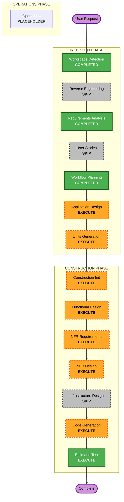

# Execution Plan

## Detailed Analysis Summary

### Transformation Scope (Brownfield)
- **Transformation Type**: Multi-component application change (service + shared library + schema migration)
- **Primary Changes**: Enforce service tenant + service user context for user-scoped memory operations; align CRUD predicates and uniqueness/index constraints
- **Related Components**:
  - `libs/soorma-service-common`
  - `services/memory`
  - `libs/soorma-common` (consumption only; no required model contract change expected)

### Change Impact Assessment
- **User-facing changes**: Yes
  - User-scoped endpoints now fail fast (`400`) when required user context is missing
- **Structural changes**: Moderate
  - Shared dependency added (`require_user_context`) and adopted by memory routes
- **Data model changes**: Yes
  - Unique/index alignment for working/task/plan context and semantic private indexes
- **API changes**: No endpoint shape changes expected
  - Behavioral validation change only
- **NFR impact**: Yes
  - Security and data isolation correctness are primary drivers

### Component Relationships (Brownfield)
## Component Relationships
- **Primary Component**: `services/memory`
- **Infrastructure Components**: Alembic migration path under `services/memory/alembic/versions/`
- **Shared Components**: `libs/soorma-service-common` dependency utilities
- **Dependent Components**: SDK and workers that call memory endpoints
- **Supporting Components**: memory service test suites (API + CRUD + migration verification)

### Risk Assessment
- **Risk Level**: Medium-High
- **Rollback Complexity**: Moderate (schema/index migration + predicate behavior changes)
- **Testing Complexity**: Complex (cross-user/cross-tenant isolation scenarios + migration checks)

## Module Update Strategy
- **Update Approach**: Hybrid sequential
- **Critical Path**:
  1. `libs/soorma-service-common` (add shared dependency)
  2. `services/memory` (adopt dependency, align CRUD predicates, migration/index updates)
- **Coordination Points**:
  - Consistent `require_user_context` behavior across all memory routers
  - Conflict-target/index parity for semantic and working memory upserts
  - Signature propagation for `service_tenant_id` + `service_user_id`
- **Testing Checkpoints**:
  - After shared dependency implementation (unit tests in `soorma-service-common`)
  - After memory code changes (memory service test suite)
  - After migration changes (upgrade/downgrade verification)

## Workflow Visualization

### Text Alternative
- Inception complete: Workspace Detection, Requirements Analysis
- Inception skipped: Reverse Engineering, User Stories
- Inception next: Application Design, Units Generation
- Construction to execute: Initialization, Functional Design, NFR Requirements, NFR Design, Code Generation, Build/Test
- Construction skipped: Infrastructure Design
- Operations remains placeholder

## Phases to Execute

### INCEPTION PHASE
- [x] Workspace Detection (COMPLETED)
- [x] Reverse Engineering (SKIPPED)
- [x] Requirements Analysis (COMPLETED)
- [x] User Stories (SKIPPED)
- [x] Workflow Planning (COMPLETED)
- [ ] Application Design - EXECUTE
  - **Rationale**: Explicitly define scope-bound design deltas for shared dependency and per-resource predicate/index alignment
- [ ] Units Generation - EXECUTE
  - **Rationale**: Work spans at least two implementation units requiring sequenced delivery and independent approval gates

### CONSTRUCTION PHASE
- [ ] Construction Phase Initialization - EXECUTE (ALWAYS)
  - **Rationale**: Load full rules for enabled extensions before per-unit work
- [ ] Functional Design - EXECUTE
  - **Rationale**: Required for design precision across two units and constraint/index correctness
- [ ] NFR Requirements - EXECUTE
  - **Rationale**: Security and isolation correctness are primary outcomes
- [ ] NFR Design - EXECUTE
  - **Rationale**: Enforce deterministic identity validation and isolation behavior patterns
- [ ] Infrastructure Design - SKIP
  - **Rationale**: No cloud/deployment/networking resource changes in this initiative
- [ ] Code Generation - EXECUTE (ALWAYS)
  - **Rationale**: Implement shared dependency, CRUD/migration/test changes
- [ ] Build and Test - EXECUTE (ALWAYS)
  - **Rationale**: Validate functional correctness and migration safety

### OPERATIONS PHASE
- [ ] Operations - PLACEHOLDER
  - **Rationale**: Future deployment/monitoring workflows

## Package Change Sequence (Brownfield)
1. `libs/soorma-service-common`
   - Add shared `require_user_context` dependency + tests
2. `services/memory`
   - Adopt shared dependency in user-scoped routers
   - Align CRUD predicates to three-column identity
   - Align unique constraints/indexes and conflict targets
   - Add migration(s) and tests

## Estimated Timeline
- **Total Stages to execute (from now)**: 10
- **Estimated Duration**: 1-2 focused development sessions

## Success Criteria
- **Primary Goal**: Eliminate identity-scope ambiguity and cross-tenant/user collision paths in Memory Service
- **Key Deliverables**:
  - shared reusable identity-context dependency
  - consistent three-column predicates across user-scoped CRUD
  - aligned DB uniqueness/indexes and upsert conflict targets
  - migration and tests proving isolation correctness
- **Quality Gates**:
  - extension compliance (security baseline, PR checkpoint, QA test-cases)
  - passing unit/integration tests for affected modules
  - migration upgrade/downgrade verification
- **Integration Testing**: validate caller behavior through memory APIs after shared dependency adoption
- **Operational Readiness**: no infra changes required; CI test coverage updated for behavior shift
