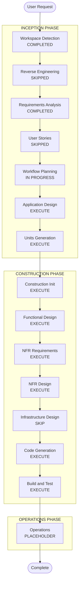

# Execution Plan
## Initiative: Multi-Tenancy Model Implementation
**Repo**: soorma-core  
**INITIATIVE_ROOT**: `aidlc-docs/platform/multi-tenancy/`  
**Date**: 2026-03-22

---

## Detailed Analysis Summary

### Transformation Scope
- **Transformation Type**: Architectural — two-tier identity model replacing single-tier UUID tenancy
- **Primary Changes**: New shared library; DB schema restructure (memory, tracker, registry); RLS policy rebuild; SDK client refactor; shared middleware
- **Related Components**: libs/soorma-common, libs/soorma-service-common (new), services/registry, services/memory, services/tracker, services/event-service, sdk/python, docs/ARCHITECTURE_PATTERNS.md

### Change Impact Assessment
- **User-facing changes**: No — all changes are infrastructure/platform-layer
- **Structural changes**: Yes — new `libs/soorma-service-common` library; DB column renames/additions; table drops
- **Data model changes**: Yes — memory service drops tenants/users tables, renames columns; registry UUID→VARCHAR; tracker column renames + new column
- **API changes**: Yes — registry API dependency drops UUID validation; memory/tracker API headers and service layer use new field names; SDK client interfaces change
- **NFR impact**: Yes — security: RLS policies rebuilt and actually enforced for the first time via set_config in shared middleware

### Component Relationships

```
libs/soorma-common  (no service deps)
        |
        +--- libs/soorma-service-common  (FastAPI + soorma-common)
        |           |
        |           +--- services/memory  (uses shared middleware + RLS)
        |           +--- services/tracker (uses shared middleware)
        |           +--- services/registry (uses shared middleware, future)
        |
        +--- sdk/python  (pure Python clients, no FastAPI)
                |
                +--- services/memory  (SDK calls memory API)
                +--- services/tracker (SDK calls tracker API)
                +--- services/registry (SDK calls registry API)
```

### Risk Assessment
- **Risk Level**: High — system-wide breaking change across 6+ components; DB schema migration; RLS policy rebuild (previously unenforced, now actively enforced for first time)
- **Rollback Complexity**: Moderate — pre-production, no production data; migrations can be reversed
- **Testing Complexity**: Complex — multi-service integration; RLS enforcement must be verified per-table; SDK integration tests must cover two-tier tenant isolation

---

## Module Update Sequence

Because this is a **breaking change** with cross-module dependencies, updates must follow this sequence:

### Critical Path (sequential — each depends on the previous)

```
Step 1: libs/soorma-common
        └── Add DEFAULT_PLATFORM_TENANT_ID constant
            (Unblocks: all other units)

Step 2: libs/soorma-service-common  [NEW LIBRARY]
        └── TenancyMiddleware with set_config + FastAPI dependency functions
            (Unblocks: Memory, Tracker service middleware adoption)

Step 3: services/registry
        └── UUID→VARCHAR migration + API deps update + ORM update
            (Independent of Memory/Tracker; can parallelise with Step 2)

Step 4: services/memory
        └── Drop tenants/users tables + rename columns + add platform_tenant_id
            + use shared middleware + rebuild RLS policies + GDPR deletion service
            (Depends on: Step 1 constant, Step 2 middleware)

Step 5: services/tracker
        └── Column renames + add platform_tenant_id + use shared middleware
            + GDPR deletion coverage
            (Depends on: Step 1 constant, Step 2 middleware)

Step 6: sdk/python
        └── Update memory/tracker clients (init-time platform_tenant_id,
            per-call service_tenant_id/service_user_id) + PlatformContext wrappers
            (Depends on: Steps 4 + 5 API surface being stable)

Step 7: docs/ARCHITECTURE_PATTERNS.md
        └── Update Section 1 with new two-tier tenancy terminology and header table
            (Can be done in parallel with any step)
```

### Parallelization Notes
- Step 2 and Step 3 can execute in parallel (no dependency between them)
- Step 7 can execute at any point
- Steps 4 and 5 can execute in parallel once Steps 1 + 2 are complete

---

## Workflow Visualization

### Text Representation

```
INCEPTION PHASE
  [x] Workspace Detection          COMPLETED
  [x] Reverse Engineering          SKIPPED (sufficient context gathered)
  [x] Requirements Analysis        COMPLETED
  [ ] User Stories                 SKIPPED (no user-facing features)
  [-] Workflow Planning            IN PROGRESS
  [ ] Application Design           EXECUTE
  [ ] Units Generation             EXECUTE

CONSTRUCTION PHASE (per unit)
  [ ] Construction Phase Init      EXECUTE (ALWAYS)
  [ ] Functional Design            EXECUTE (per unit — new data models, business rules)
  [ ] NFR Requirements             EXECUTE (security + RLS enforcement)
  [ ] NFR Design                   EXECUTE (RLS policy patterns, set_config strategy)
  [ ] Infrastructure Design        SKIP (no cloud/infra changes; DB migrations handled in code)
  [ ] Code Generation              EXECUTE (ALWAYS)
  [ ] Build and Test               EXECUTE (ALWAYS)

OPERATIONS PHASE
  [ ] Operations                   PLACEHOLDER
```

### Mermaid Diagram



---

## Phases to Execute

### INCEPTION PHASE
- [x] Workspace Detection — COMPLETED
- [x] Reverse Engineering — SKIPPED (user provided detailed requirements; targeted codebase exploration sufficient)
- [x] Requirements Analysis — COMPLETED
- [ ] User Stories — **SKIP**
  - **Rationale**: No user-facing features; purely infrastructure/platform changes with no user experience impact; single architect/developer-facing architectural change
- [-] Workflow Planning — IN PROGRESS
- [ ] Application Design — **EXECUTE**
  - **Rationale**: New library (`libs/soorma-service-common`) requires component definition; `TenancyMiddleware` and `PlatformTenantDataDeletion` are new service components with well-defined method contracts that must be specified before code generation
- [ ] Units Generation — **EXECUTE**
  - **Rationale**: 6 distinct packages/components require coordinated changes with a defined update sequence and interdependencies; decomposition into units ensures each can be designed, implemented, and tested independently

### CONSTRUCTION PHASE
- [ ] Construction Phase Initialization — EXECUTE (ALWAYS)
- [ ] Functional Design — **EXECUTE** (per applicable unit)
  - **Rationale**: New data models (three-column identity schema), new RLS policy patterns, new `PlatformTenantDataDeletion` service interface, and new `TenancyMiddleware` component all require functional design specification
- [ ] NFR Requirements — **EXECUTE** (for memory + soorma-service-common units)
  - **Rationale**: Active RLS enforcement is a security NFR that was previously unenforced; must be formally specified with test criteria
- [ ] NFR Design — **EXECUTE** (for memory + soorma-service-common units)
  - **Rationale**: `set_config` + RLS policy pattern requires design specification covering transaction scoping, session variable lifecycle, and policy expressions
- [ ] Infrastructure Design — **SKIP**
  - **Rationale**: No cloud infrastructure, IaC, or deployment model changes; Alembic DB migrations are handled as part of Code Generation, not Infrastructure Design
- [ ] Code Generation — EXECUTE (ALWAYS, per unit)
- [ ] Build and Test — EXECUTE (ALWAYS)

### OPERATIONS PHASE
- [ ] Operations — PLACEHOLDER

---

## Units of Work (Proposed — subject to Units Generation stage)

| Unit | Component | Change Type | Depends On |
|---|---|---|---|
| U1 | `libs/soorma-common` | Minor — add constant + `platform_tenant_id` field on `EventEnvelope` | — |
| U2 | `libs/soorma-service-common` | Major — new library | U1 |
| U3 | `services/registry` | Moderate — UUID→VARCHAR migration + API | U1 |
| U4 | `services/memory` | Major — DB restructure + RLS rebuild + GDPR | U1, U2 |
| U5 | `services/tracker` | Moderate — column renames + new column + middleware; NATS path trusts `event.platform_tenant_id` | U1, U2 |
| U6 | `sdk/python` | Moderate — client refactor + PlatformContext update | U4, U5 |
| U7 | `services/event-service` | Minor — register `TenancyMiddleware` + inject `platform_tenant_id` at publish | U1, U2 |

*(U2 and U3 can execute in parallel; U4, U5, and U7 can execute in parallel after U1 + U2.)*

---

## Success Criteria
- **Primary Goal**: Two-tier tenancy model fully implemented across soorma-core; service tenant/user IDs scoped by platform tenant in all data stores
- **Key Deliverables**:
  - All UUID tenant/user ID columns replaced with VARCHAR(64)
  - `libs/soorma-service-common` with working `TenancyMiddleware` and `set_config` activation
  - Memory service: tenants/users tables removed; three-column identity on all tables; RLS policies rebuilt and verified to enforce isolation
  - Tracker service: column renames + platform_tenant_id added; isolation enforced
  - Registry service: UUID validation removed; string tenant IDs accepted
  - SDK clients: platform_tenant_id at init-time; service_tenant_id/service_user_id per-call
  - GDPR deletion service covering all memory + tracker tables
  - Event Service: `TenancyMiddleware` registered; `platform_tenant_id` injected into `EventEnvelope` at publish from authenticated `X-Tenant-ID` header
- **Quality Gates**:
  - Existing test suite passes with updated tenant/user ID format
  - RLS isolation verified: query with wrong platform_tenant_id returns zero rows
  - SDK integration tests pass with two-tier tenant context
  - `set_config` verified to activate before each DB query in middleware tests
