# Developer Guide

**Status:** 📝 Draft  
**Last Updated:** January 6, 2026

This guide covers developer experience (DX) patterns, workflows, and testing strategies for building with Soorma.

---

## Overview

Soorma optimizes for three user journeys:

1. **Solo Creator** - Build agents quickly from zero to production
2. **Integration Developer** - Integrate Soorma into existing applications
3. **Self-Hoster** - Deploy the full platform on your own infrastructure

---

## 1. The Solo Creator (Zero to Agent)

### 1.1 Installation

> **Pre-Launch Phase:** Install from local source to stay synchronized with breaking changes:

```bash
# Clone the repository
git clone https://github.com/soorma-ai/soorma-core.git
cd soorma-core

# Install from source
pip install -e sdk/python
```

### 1.2 CLI Commands

The `soorma` command is bundled in the SDK:

| Command | Description |
|---------|-------------|
| `soorma dev --build` | Builds local infrastructure (Registry + NATS + Memory + Event Service) |
| `soorma init <name>` | Scaffolds a new agent project with boilerplate |
| `soorma deploy` | Deploys to Soorma Cloud (planned) |

### 1.3 Typical Workflow

```bash
# 1. Install the SDK from local source
cd soorma-core
pip install -e sdk/python

# 2. Build local infrastructure
export OPENAI_API_KEY=your_key_here
soorma dev --build

# 3. Create a new agent project (scaffolding)
soorma init my-agent
cd my-agent

# 4. Implement agent logic with AI assistance
# See AI Assistant Guide for using examples with Copilot/Cursor

# 5. Your agent code runs natively, connects to Docker services
python agent.py
```

> 💡 **AI-Assisted Development:** Use `soorma init` to generate scaffolding, then leverage examples with GitHub Copilot or Cursor to implement your agent logic. See the **[AI Assistant Guide](./AI_ASSISTANT_GUIDE.md)** for effective prompting patterns and workflows.

### 1.4 The "Infra in Docker, Code on Host" Pattern

`soorma dev` implements a **hybrid execution model** for fast iteration:

```mermaid
graph TB
    subgraph DevMachine["Developer's Machine"]
        subgraph Docker["Docker Containers (Infrastructure)"]
            Registry["Registry Service<br/>:8000"]
            EventService["Event Service<br/>:8001"]
            Memory["Memory Service<br/>:8002"]
            NATS["NATS JetStream<br/>:4222"]
            Postgres["PostgreSQL + pgvector<br/>:5432"]
            
            EventService <--> NATS
            Memory --> Postgres
        end
        
        subgraph Native["Native Python Process (Your Agent)"]
            Agent["agent.py<br/>• Hot Reload on File Change<br/>• Full debugger support"]
        end
        
        Agent -->|"HTTP API"| Registry
        Agent -->|"HTTP API + SSE"| EventService
        Agent -->|"HTTP API"| Memory
    end
    
    style Docker fill:#e1f5ff
    style Native fill:#fff4e1
    style Agent fill:#f0f0f0
```



**Why this pattern?**

1. **Fast Iteration:** Change `agent.py`, save, instant effect. No `docker build` cycle.
2. **Debuggability:** Attach debugger directly to your agent code.
3. **Production Parity:** Infrastructure is containerized, identical to production.
4. **No Port Conflicts:** Services use standard ports (8000, 8001, 4222).

**How it works:**

1. **`soorma dev` starts Docker Compose stack:**
   ```bash
   docker compose -f ~/.soorma/docker-compose.yml up -d
   ```

2. **Your agent runs natively with environment variables:**
   ```bash
   export SOORMA_REGISTRY_URL="http://localhost:8081"
   export SOORMA_EVENT_SERVICE_URL="http://localhost:8082"
   export SOORMA_MEMORY_SERVICE_URL="http://localhost:8083"
   python agent.py
   ```

3. **Services are production-ready running on local docker:**
   - Registry Service: Agent and Event registry
   - NATS: JetStream message bus for reliable event delivery
   - Event Service: Proxy to NATS with SSE support
   - Memory Service: PostgreSQL with pgvector for semantic memory
   - PostgreSQL: Persistent database for services

---

## 2. The Integration Developer

Integrate `soorma-core` into existing Python applications.

### 2.1 Use Cases

- Offload cognitive tasks to Soorma agents
- Add AI capabilities to existing services
- Connect to your own infrastructure
- Use the SDK programmatically without the CLI

### 2.2 Example Integration

```python
from soorma import Worker, PlatformContext
from soorma_common import EventDefinition, EventTopic, EventEnvelope

# Define events
DATA_RECEIVED = EventDefinition(
    event_name="data.received",
    topic=EventTopic.BUSINESS_FACTS,
    description="Data has been received for processing",
    payload_schema={...}
)

DATA_PROCESSED = EventDefinition(
    event_name="data.processed",
    topic=EventTopic.ACTION_RESULTS,
    description="Data processing completed",
    payload_schema={...}
)

# Create a worker agent
worker = Worker(
    name="data-processor",
    description="Processes data events",
    capabilities=["data-processing"],
    events_consumed=[DATA_RECEIVED],
    events_produced=[DATA_PROCESSED]
)

@worker.on_event("data.received", topic=EventTopic.BUSINESS_FACTS)
async def process_data(event: EventEnvelope, context: PlatformContext):
    # Access event data
    data = event.data or {}
    
    # Your processing logic
    result = process(data)
    
    # Publish result with proper topic enum
    await context.bus.publish(
        event_type="data.processed",
        topic=EventTopic.ACTION_RESULTS,
        data={"result": result},
        correlation_id=event.correlation_id,
        tenant_id=event.tenant_id,
        user_id=event.user_id,
    )

# Run the worker
worker.run()
```

### 2.3 Configuration

Configure service URLs via environment variables:

```bash
export SOORMA_REGISTRY_URL="https://your-registry.example.com"
export SOORMA_EVENT_SERVICE_URL="https://your-events.example.com"
export SOORMA_MEMORY_SERVICE_URL="https://your-memory.example.com"
```

Or programmatically:

```python
from soorma import Worker

worker = Worker(
    name="my-agent",
    registry_url="https://your-registry.example.com",
    event_service_url="https://your-events.example.com",
    memory_service_url="https://your-memory.example.com"
)
```

---

## 3. The Self-Hoster

Deploy the full platform to your own infrastructure.

### 3.1 Docker Compose Deployment

**Local Development:**
```bash
soorma dev --build
```

**Production (Planned):**
```bash
cd iac/docker-compose
docker compose -f production.yml up -d
```

Services:
- Registry Service: Port 8000
- Event Service: Port 8001
- Memory Service: Port 8002
- NATS: Port 4222
- PostgreSQL: Port 5432

### 3.2 Kubernetes Deployment (Planned)

```bash
cd iac/helm
helm install soorma ./soorma-core
```

### 3.3 Cloud Managed (Planned)

Deploy to Soorma Cloud:
```bash
soorma deploy --target cloud
```

---

## 4. Testing Strategy

### 4.1 SDK Tests

```bash
cd sdk/python
pytest tests/ -v

# Run specific test file
pytest tests/test_registry_client.py -v

# With coverage
pytest tests/ --cov=soorma --cov-report=html
```

### 4.2 Service Tests

```bash
cd services/registry
pytest test/ -v

cd services/event-service
pytest test/ -v

cd services/memory
pytest test/ -v
```

### 4.3 Integration Tests

Test agents with real services:

```python
import pytest
import subprocess

@pytest.fixture
async def test_stack():
    """Start test stack with Docker."""
    subprocess.run(["soorma", "dev", "--build"], check=True)
    yield
    # Cleanup
    subprocess.run(["docker", "compose", "down"], check=True)

async def test_agent_workflow(test_stack):
    """Test complete agent workflow."""
    # Your integration test code
    pass
```

### 4.4 Example Tests

Examples should be executable and tested:

```bash
cd examples/01-hello-world
python -m pytest test_worker.py -v

cd examples/03-events-structured
python client.py  # Run the example to see LLM-based routing
```

### 4.5 Best Practices

- **Unit Tests:** Test individual functions and classes
- **Integration Tests:** Test with real services (Docker stack)
- **E2E Tests:** Test complete workflows with multiple agents
- **Coverage:** Aim for >80% coverage on SDK and services
- **Fixtures:** Use pytest fixtures for common setup
- **Mocking:** Mock external APIs (LLMs, web services) in unit tests

---

## 5. Development Workflow

### 5.1 Hot Reload

When running agents natively (outside Docker), changes take effect immediately:

```bash
# Edit your agent code
vim agent.py

# Save and the agent automatically reloads
# No restart needed!
```

### 5.2 Debugging

Attach your debugger directly to agent processes:

**VS Code (launch.json):**
```json
{
  "version": "0.2.0",
  "configurations": [
    {
      "name": "Python: Current File",
      "type": "python",
      "request": "launch",
      "program": "${file}",
      "console": "integratedTerminal",
      "env": {
        "SOORMA_REGISTRY_URL": "http://localhost:8081",
        "SOORMA_EVENT_SERVICE_URL": "http://localhost:8082",
        "SOORMA_MEMORY_SERVICE_URL": "http://localhost:8083",
        "OPENAI_API_KEY": "${env:OPENAI_API_KEY}"
      }
    }
  ]
}
```

**PyCharm:**
1. Right-click on `agent.py` → Debug
2. Add environment variables in Run Configuration

### 5.3 Logging

Soorma agents use standard Python logging:

```python
import logging

logging.basicConfig(level=logging.DEBUG)
logger = logging.getLogger(__name__)

@worker.on_event("data.received")
async def process_data(event: dict, context: PlatformContext):
    logger.info(f"Processing event: {event['event_type']}")
    logger.debug(f"Event data: {event['data']}")
```

---

## 6. Multi-Provider LLM Support

Soorma examples demonstrate provider-agnostic LLM integration via LiteLLM.

### 6.1 Supported Providers

- OpenAI (GPT-4, GPT-4o, etc.)
- Anthropic (Claude 3, etc.)
- Google (Gemini)
- Azure OpenAI
- Together AI
- Groq
- Any LiteLLM-compatible provider

### 6.2 Configuration

Set provider-specific environment variables:

```bash
# OpenAI
export OPENAI_API_KEY=your_key_here

# Anthropic
export ANTHROPIC_API_KEY=your_key_here

# Google
export GOOGLE_API_KEY=your_key_here

# Azure OpenAI
export AZURE_API_KEY=your_key_here
export AZURE_API_BASE=your_endpoint
export AZURE_API_VERSION=your_version
```

### 6.3 Usage Pattern

The 03-events-structured example demonstrates multi-provider LLM support:

```python
import os
from litellm import completion

# Auto-detect model from environment
model = os.getenv("LLM_MODEL", "gpt-4o-mini")

# Works with any LiteLLM-compatible provider
response = completion(
    model=model,
    messages=[{"role": "user", "content": prompt}],
    response_format={"type": "json_object"}
)
```

**Supported model formats:**
- OpenAI: `gpt-4o-mini`, `gpt-4`, `gpt-4-turbo`
- Anthropic: `claude-3-5-sonnet-20241022`, `claude-3-opus`
- Google: `gemini/gemini-pro`
- Azure: `azure/gpt-4`
- Groq: `groq/llama3-70b-8192`

See [examples/03-events-structured/llm_utils.py](../examples/03-events-structured/llm_utils.py) for complete implementation.

---

## 7. Common Workflows

### 7.1 Creating a New Agent

```bash
# Initialize project (generates scaffolding)
soorma init my-agent
cd my-agent

# Implement agent logic with AI assistance
# Reference examples in Copilot/Cursor prompts:
#   "Create a worker like examples/01-hello-world that handles order.created events"
# See docs/AI_ASSISTANT_GUIDE.md for more patterns

# Edit agent code (with or without AI assistance)
vim agent.py

# Run locally
python agent.py
```

### 7.2 Testing Locally

```bash
# Start infrastructure
soorma dev --build

# Run your agent
python agent.py

# In another terminal, send test events
python test_client.py
```

### 7.3 Debugging Issues

```bash
# Check service logs
docker logs soorma-registry
docker logs soorma-event-service
docker logs soorma-memory

# Check agent registration
curl http://localhost:8081/agents

# Check events
curl http://localhost:8081/events
```

### 7.4 Deploying

```bash
# Build Docker image for your agent
docker build -t my-agent:latest .

# Deploy to production stack
docker compose -f production.yml up -d
```

---

## Related Documentation

- [Architecture](../ARCHITECTURE.md) - Platform services and infrastructure
- [Agent Patterns](./agent_patterns/README.md) - Tool, Worker, Planner models and DisCo pattern
- [Event System](./event_system/README.md) - Event-driven architecture, topics, messaging
- [Memory System](./memory_system/README.md) - CoALA framework and memory types
- [Discovery](./discovery/README.md) - Registry and capability discovery
- [AI Assistant Guide](./AI_ASSISTANT_GUIDE.md) - Using examples with Copilot/Cursor for rapid development
- [Examples](../examples/) - Working implementations

---

**Questions?** Check [AGENT.md](../AGENT.md) for AI assistant instructions or [README.md](../README.md) for getting started.
