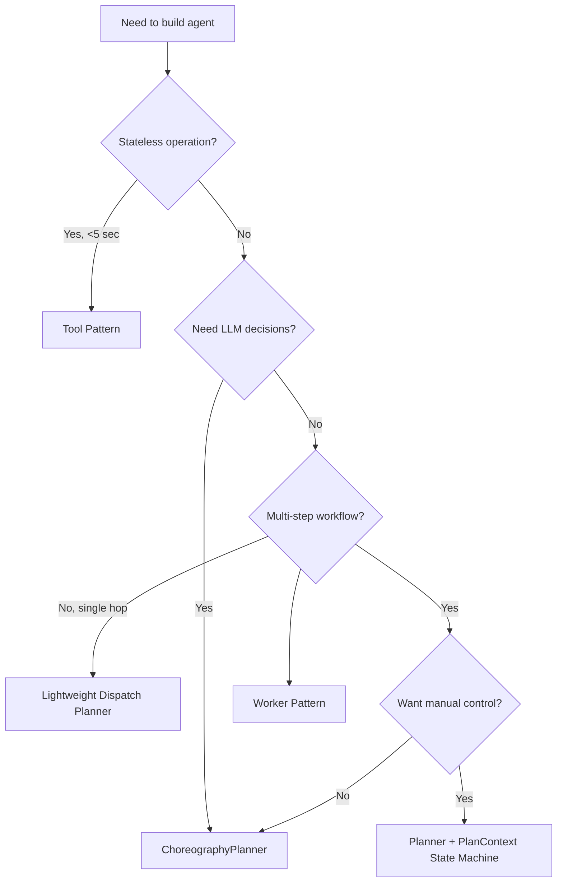

# Agent Patterns

**Status:** ✅ Stage 4 Complete (Planner & ChoreographyPlanner)  
**Last Updated:** February 23, 2026  
**Related Stages:** Stage 3 (RF-SDK-004, RF-SDK-005, RF-SDK-022), Stage 4 (RF-SDK-006, RF-SDK-015, RF-SDK-016)

---

## Overview

Soorma agents can be organized using various patterns depending on your use case. This guide helps you choose the right pattern for your needs.

Agents are built on the **DisCo (Distributed Cognition)** pattern, where intelligence is distributed across specialized components that communicate through events. Instead of one monolithic agent doing everything, you compose systems of specialized agents that work together.

---

## Pattern Selection Framework

**Choose the right pattern for your use case.** This framework helps you decide which agent pattern fits your requirements.

### Decision Criteria

| Pattern | When to Use | Execution | State | Decision Making | Cost |
|---------|-------------|-----------|-------|-----------------|------|
| **Tool** | Stateless operation, <5 sec, simple I/O | Synchronous | None | Deterministic | Free |
| **Worker** | Async task, needs delegation, parallel work | Asynchronous | Persistent | Deterministic | Free |
| **Planner (Lightweight Dispatch)** | Single-hop, no branching, fits in two handlers | Event-driven | None (working memory only) | Developer-defined | Free |
| **Planner (State Machine)** | Multi-step workflow, explicit states, durable | Event-driven | State machine | Developer-defined | Free |
| **ChoreographyPlanner** | Adaptive workflow, LLM reasoning | Event-driven | LLM-managed | Autonomous | LLM API |

### Decision Flowchart



### Pattern Tradeoffs

| Pattern | Control | Complexity | Latency | Best For |
|---------|---------|------------|---------|----------|
| **Tool** | Full | ⭐ Beginner | <100ms | Calculations, lookups, transformations |
| **Worker** | High | ⭐⭐ Intermediate | 100ms-5s | Async tasks, delegation, aggregation |
| **Planner (Lightweight)** | High | ⭐⭐ Intermediate | 100ms-5s | Single-hop orchestration, dynamic discovery |
| **Planner (State Machine)** | Full | ⭐⭐⭐ Advanced | Varies | Durable multi-step workflows |
| **ChoreographyPlanner** | Autonomous | ⭐⭐⭐⭐ Expert | 1-10s | Adaptive workflows, LLM reasoning |

### Real-World Examples

| Your Need | Choose This Pattern | Example Use Case |
|-----------|---------------------|------------------|
| "I need to validate user input" | **Tool** | Email validator, JSON schema checker |
| "I need to process orders with inventory + payment steps" | **Worker** | E-commerce order processor with sequential delegation |
| "I need a single-hop planner: discover worker, dispatch, respond" | **Lightweight Dispatch Planner** | Research planner with runtime worker discovery |
| "I need a multi-stage approval workflow" | **Planner + State Machine** | Document approval with states: draft → review → approved |
| "I need autonomous research with adaptive queries" | **ChoreographyPlanner** | Research assistant that explores topics dynamically |

**Quick Tips:**
- Start simple: Use **Tool** for pure functions, **Worker** for delegation
- Use **Planner** when you know all states/transitions upfront
- Use **ChoreographyPlanner** when the path depends on intermediate results
- Avoid ChoreographyPlanner for simple tasks (unnecessary LLM cost)

---

## Pattern Catalog

### 1. Agent Pattern (Base)

**Use when:** Custom event handling with full control

**Complexity:** ⭐ Beginner

**Example:** [01-hello-world](../../examples/01-hello-world/)

```python
from soorma import Agent
from soorma_common import EventTopic

agent = Agent(name="my-agent", capabilities=["custom"])

@agent.on_event(topic=EventTopic.BUSINESS_FACTS, event_type="order.placed")
async def handle(event, context):
    # Custom event processing
    await context.bus.publish(
        topic=EventTopic.ACTION_REQUESTS,
        event_type="inventory.check",
        data=event.data
    )
```

**Characteristics:**
- Full control over event handling
- Explicit topic specification
- Base class for Tool, Worker, Planner
- No built-in patterns

**Best for:**
- Custom workflows
- Learning the event model
- Prototyping new patterns

---

### 2. Tool Pattern (Synchronous)

**Use when:** Stateless, synchronous operations

**Complexity:** ⭐ Beginner

**Example:** [01-hello-tool](../../examples/01-hello-tool/)

```python
from soorma import Tool

tool = Tool(name="calculator", capabilities=["math"])

@tool.on_invoke(event_type="calculate.requested")
async def calculate(request, context):
    # Handler returns result directly
    result = eval(request.data["expression"])
    return {"result": result}  # Auto-published to caller's response_event
```

**Characteristics:**
- Stateless operations
- Handler returns result directly
- SDK auto-publishes response to caller's `response_event`
- No manual completion needed
- Uses `action-requests` / `action-results` topics

**Best for:**
- Calculations and transformations
- API calls and lookups
- Simple utilities
- Pure functions

---

### 3. Worker Pattern (Asynchronous)

**Use when:** Stateful tasks with delegation

**Complexity:** ⭐⭐ Intermediate

**Example:** [08-worker-basic](../../examples/08-worker-basic/)

```python
from soorma import Worker

worker = Worker(name="order-processor", capabilities=["orders"])

@worker.on_task(event_type="order.process.requested")
async def handle(task, context):
    # Save state for async completion
    await task.save()
    
    # Delegate to sub-agents
    await task.delegate(
        event_type="inventory.reserve.requested",
        data={"order_id": task.data["order_id"]},
        response_event="inventory.reserved"
    )
    # Handler returns - completion happens later

@worker.on_result(event_type="inventory.reserved")
async def handle_result(result, context):
    # Restore original task
    task = await result.restore_task()
    
    # Complete the task
    await task.complete({"status": "processed"})
```

**Characteristics:**
- Stateful with TaskContext persistence
- Can delegate to sub-agents (sequential or parallel)
- Manual completion via `task.complete()`
- Async choreography across event boundaries
- Uses `action-requests` / `action-results` topics

**Best for:**
- Multi-step workflows
- Orchestrating sub-agents
- Tasks requiring external results
- Complex business logic

**Advanced: Parallel Delegation (Fan-out/Fan-in)**

```python
from soorma.task_context import DelegationSpec

@worker.on_task(event_type="order.fulfill.requested")
async def handle(task, context):
    await task.save()
    
    # Delegate multiple tasks in parallel
    group_id = await task.delegate_parallel([
        DelegationSpec(
            event_type="inventory.reserve.requested",
            data={"order_id": task.data["order_id"]},
            response_event="inventory.done"
        ),
        DelegationSpec(
            event_type="payment.process.requested",
            data={"amount": task.data["total"]},
            response_event="payment.done"
        )
    ])

@worker.on_result(event_type="inventory.done")
@worker.on_result(event_type="payment.done")
async def handle_results(result, context):
    task = await result.restore_task()
    
    # Check if all parallel tasks completed
    results = await task.aggregate_parallel_results(group_id)
    if results:
        await task.complete({"all_done": results})
```

---

### 4. Planner Pattern (State Machine)

**Use when:** Multi-step workflows with event-driven state transitions

**Complexity:** ⭐⭐ Intermediate

**Example:** [09-planner-basic](../../examples/09-planner-basic/)

```python
from soorma import Planner
from soorma.agents.planner import GoalContext
from soorma.context import PlatformContext
from soorma.plan_context import PlanContext
from soorma_common.events import EventEnvelope
from soorma_common.state import StateConfig, StateAction, StateTransition

planner = Planner(name="research-planner", capabilities=["research"])

@planner.on_goal("research.goal")
async def plan_research(goal: GoalContext, context: PlatformContext):
    # Define state machine
    states = {
        "start": StateConfig(
            state_name="start",
            default_next="research"
        ),
        "research": StateConfig(
            state_name="research",
            action=StateAction(
                event_type="research.task",
                response_event="research.complete",
                data={"query": "{{goal_data.topic}}"}
            ),
            transitions=[
                StateTransition(on_event="research.complete", to_state="complete")
            ]
        ),
        "complete": StateConfig(
            state_name="complete",
            is_terminal=True
        )
    }
    
    # Create and execute plan
    plan = await PlanContext.create_from_goal(
        goal=goal,
        context=context,
        state_machine=states,
        current_state="start",
        status="pending",
    )
    await plan.execute_next()

@planner.on_transition()
async def handle_transition(
    event: EventEnvelope,
    context: PlatformContext,
    plan: PlanContext,
    next_state: str,
) -> None:
    """SDK auto-filters and restores plan."""
    # Update state
    plan.current_state = next_state
    plan.results[event.type] = event.data
    
    # Execute or finalize
    if plan.is_complete():
        await plan.finalize(result=event.data)
    else:
        await plan.execute_next(event)
```

**Characteristics:**
- Declarative state machine definition
- Event-driven state transitions
- Plan persistence and restoration
- Clean handler signature (no manual restore/filtering)
- SDK handles authentication context validation
- Automatic correlation-based routing

**SDK Behavior:**
- `@on_transition()` subscribes to action-results only
- SDK requires `tenant_id`/`user_id` for plan restoration
- SDK auto-restores plan from Memory Service
- SDK validates transition exists in state machine
- Handler only invoked if plan and transition are valid

**Authentication Context:**
Workers MUST propagate authentication in responses:
```python
await context.bus.respond(
    event_type=event.response_event,
    data=result,
    correlation_id=event.correlation_id,
    tenant_id=event.tenant_id,      # Required for plan restoration
    user_id=event.user_id,          # Required for RLS policies
    session_id=event.session_id,    # Recommended
)
```

**Best for:**
- Multi-step workflows with clear state transitions
- Orchestrating workers/tools
- Long-running processes
- Workflows requiring persistence across restarts

---

### 4b. Lightweight Dispatch Planner

**Use when:** Single-hop orchestration — one worker, no branching, fits in two handlers

**Complexity:** ⭐⭐ Intermediate

**Example:** [11-discovery-llm](../../examples/11-discovery-llm/)

```python
from soorma.ai.choreography import ChoreographyPlanner
from soorma.agents.planner import GoalContext
from soorma.context import PlatformContext
from soorma_common.events import EventEnvelope, EventTopic

planner = ChoreographyPlanner(name="research-planner", ...)

# Handler 1: receive goal, dispatch to worker
@planner.on_goal("research.goal")
async def handle_goal(goal: GoalContext, context: PlatformContext):
    # SDK on_goal hook auto-saves goal metadata to working memory
    # (response_event, response_schema_name, tenant_id, user_id)
    # under plan_id=correlation_id — no manual store needed
    payload = await planner.generate_payload(schema=schema, context=description)
    await goal.dispatch(
        event_type="research.requested",
        data=payload,
        response_event="research.worker.completed",
    )
    # Handler returns — no state machine, no PlanContext

# Handler 2: receive worker result, respond to client
@planner.on_event("research.worker.completed", topic=EventTopic.ACTION_RESULTS)
async def handle_result(event: EventEnvelope, context: PlatformContext):
    goal_meta = await context.memory.get_goal_metadata(
        correlation_id=event.correlation_id,
        tenant_id=event.tenant_id,
        user_id=event.user_id,
    )
    await context.bus.respond(
        event_type=goal_meta["response_event"],
        data=result,
        correlation_id=event.correlation_id,
        tenant_id=event.tenant_id,
        user_id=event.user_id,
    )
```

**`goal.dispatch()` — the key primitive**

`goal.dispatch()` is the planner-side mirror of `task.delegate()` on the Worker side.
It wraps `context.bus.request()` and auto-propagates `tenant_id`, `user_id`,
`correlation_id`, and `session_id` from the `GoalContext` — identical to how
`task.delegate()` auto-propagates context from `TaskContext`. Never use
`context.bus.request()` directly in an `on_goal` handler.

```python
# ✅ Correct
await goal.dispatch(event_type="research.requested", data=payload,
                   response_event="research.worker.completed")

# ❌ Wrong — manual threading is fragile
await context.bus.request(event_type="research.requested", data=payload,
                          response_event="research.worker.completed",
                          correlation_id=goal.correlation_id,   # easy to forget
                          tenant_id=goal.tenant_id,             # easy to forget
                          user_id=goal.user_id)                 # easy to forget
```

**How goal metadata storage works**

The `@on_goal` SDK hook automatically stores goal routing metadata
(`response_event`, `response_schema_name`, `tenant_id`, `user_id`) to working
memory before calling your handler. The `correlation_id` is used as `plan_id`
because no formal `PlanContext` (and therefore no generated UUID `plan_id`) exists.
The result handler retrieves this via `context.memory.get_goal_metadata()`.

**Characteristics:**
- No `PlanContext` or state machine — two plain event handlers
- `@on_goal` SDK hook auto-saves goal routing metadata to working memory
- `goal.dispatch()` auto-propagates full auth/correlation context
- `context.memory.get_goal_metadata()` retrieves routing info in the result handler
- Client can own the response schema (passed via `response_schema_name` in the goal envelope)

**Contrast with PlanContext pattern:**

| | Lightweight Dispatch | PlanContext State Machine |
|---|---|---|
| Workflow steps | 1 worker, 1 hop | Multiple workers, multiple steps |
| State persistence | Working memory only | Full plan record in Memory Service |
| Resumability | No | Yes (survives restarts) |
| Handler structure | 2 `@on_event` handlers | `@on_goal` + `@on_transition` |
| Memory scope | `plan_id=correlation_id` | `plan_id=plan.plan_id` (generated UUID) |

**Best for:**
- Runtime worker discovery + LLM-generated payloads
- Client-owned response schema contracts
- Single-hop: request → result → respond to client
- When workflow fits in two event handlers

**Use when:** Goal-driven task decomposition with clear steps

**Complexity:** ⭐⭐ Intermediate

**Example:** [09-planner-basic](../../examples/09-planner-basic/)

**Architecture:**
- **Planner:** Orchestrates workflow via state machine
- **Worker:** Executes specific tasks/capabilities
- **Tool:** Provides reusable, stateless operations

**Characteristics:**
- Clear separation of concerns (strategy vs execution vs utilities)
- Planner handles workflow orchestration
- Workers handle domain-specific execution
- Tools provide shared, reusable capabilities
- Explicit task coordination

**Best for:**
- Multi-step workflows with predictable patterns
- Task assignment to specialized workers
- Reusable operations that multiple agents need
- When control flow is well-understood
- Applications requiring auditability and observability

---

### 6. Autonomous Choreography Pattern (ChoreographyPlanner)

**Use when:** Complex, adaptive workflows where LLM decides next steps

**Complexity:** ⭐⭐⭐ Advanced

**Status:** ✅ Available in Stage 4 Phase 2+

**Example:** [09-app-research-advisor](../../examples/09-app-research-advisor/) (Stage 4)

```python
from soorma.ai.choreography import ChoreographyPlanner
from soorma.plan_context import PlanContext

planner = ChoreographyPlanner(
    name="order-processor",
    reasoning_model="gpt-4o",
    system_instructions="""Orders >$5k require manager approval.""",
)

@planner.on_goal("order.received")
async def handle_order(goal, context):
    plan = await PlanContext.create_from_goal(
        goal=goal,
        context=context,
        state_machine={},  # ChoreographyPlanner uses LLM, not state machine
        current_state="reasoning",
        status="running",
    )
    decision = await planner.reason_next_action(
        trigger=f"Order: ${goal.data['amount']}",
        context=context,
        custom_context={"policy": "High-value approval required"},
    )
    await planner.execute_decision(decision, context, goal, plan)
```

**How it works:**
1. Planner receives goal event (e.g., `order.received`)
2. LLM discovers available events from Registry
3. LLM reasons about next action based on:
   - Current goal and context
   - Business rules (system_instructions)
   - Runtime data (custom_context)
   - Available capabilities (discovered events)
   - Previous actions taken
4. Planner executes decision:
   - **PUBLISH:** Publish event to trigger workers
   - **COMPLETE:** Finalize plan with response
   - **WAIT:** Pause for external input (approval, upload, callback)
   - **DELEGATE:** Forward to another planner
5. Worker/external system responds, process repeats

**Event-driven flow:**
- No loops - each step is triggered by incoming events
- State tracked in Working Memory and PlanContext
- Circuit breaker (max_actions) prevents runaway workflows
- LLM adapts based on results from each step

**WAIT Action (Human-in-the-Loop):**
The ChoreographyPlanner can pause plans for external input:
```python
# LLM decides: WAIT for manager approval
decision = WaitAction(
    reason="Transaction >$5k requires approval",
    expected_event="approval.granted",
)
# Plan pauses until approval event arrives
```

**Use Cases for WAIT:**
- Financial approvals (transactions >threshold)
- Document uploads (user must provide file)
- External API callbacks (payment verification)
- User clarification (ambiguous requests)

**See:** [WAIT_ACTION_GUIDE.md](./WAIT_ACTION_GUIDE.md) for complete guide with examples and troubleshooting.

**Characteristics:**
- No predefined workflow - LLM decides dynamically
- Events discovered at runtime from Registry
- Custom business logic via system_instructions
- Runtime context injection via custom_context
- Self-adapting to available capabilities
- Fully event-driven (no while loops)
- Circuit breaker prevents infinite action sequences
- Pause/resume support for HITL workflows

**Best for:**
- Unpredictable workflows where steps depend on intermediate results
- Complex decision trees with many possible paths
- Human approval workflows (financial, compliance)
- Adaptive systems that evolve with available capabilities
- When requirements change frequently
- Research, exploration, and creative tasks

---

### 7. Saga Pattern (Distributed Transactions)

**Use when:** Multi-step transactions that need rollback

**Complexity:** ⭐⭐⭐ Advanced

**Status:** 🔮 Future

```python
# Coordinator tracks saga state
@worker.on_task(event_type="order.create")
async def start_saga(task, context):
    saga_id = generate_id()
    
    # Step 1: Reserve inventory
    await task.delegate(
        event_type="inventory.reserve",
        data={"saga_id": saga_id}
    )
    
# If any step fails, compensate
@worker.on_result(event_type="inventory.failed")
async def compensate(result, context):
    task = await result.restore_task()
    # Undo previous steps
    await context.bus.publish(
        topic=EventTopic.ACTION_REQUESTS,
        event_type="order.cancel",
        data={"saga_id": saga_id}
    )
```

**Characteristics:**
- Manages distributed transactions
- Compensation logic for failures
- State tracking across services
- Eventually consistent

**Best for:**
- Order processing
- Booking systems
- Financial transactions
- Multi-service updates

---

## Plans and Sessions: Workflow Organization

### Conceptual Model

The Memory Service provides two organizational constructs for structuring multi-agent workflows:

| Concept | Purpose | Scope | Typical Use |
|---------|---------|-------|-------------|
| **Plan** | Individual work unit/workflow execution | Single goal execution | Chat conversation, research task, document generation |
| **Session** | Container grouping related plans | Multi-plan conversation | Multi-turn project, extended research session, user journey |

### When to Use Plans vs Sessions

#### Use Plans Alone When:

✅ Simple single-conversation chatbots  
✅ One-off task execution  
✅ Independent workflow instances  
✅ No need to group related work

**Example: Simple Chatbot**
```python
# Each conversation = one plan
plan_id = str(uuid.uuid4())
state = WorkflowState(context, plan_id)

# Store conversation state
await state.set("history", messages)
```

#### Use Plans + Sessions When:

✅ Multi-turn research projects (multiple plans per project)  
✅ Complex user journeys (multiple related workflows)  
✅ Need to group and query related work units  
✅ Long-running interactions with multiple sub-goals

**Example: Research Project**
```python
# Create session for the project
session_id = "research-project-123"

# Create multiple plans within the session
plan1_id = await create_plan(session_id=session_id, goal="literature_review")
plan2_id = await create_plan(session_id=session_id, goal="data_analysis")
plan3_id = await create_plan(session_id=session_id, goal="write_report")

# Each plan has its own working memory
state1 = WorkflowState(context, plan1_id)
state2 = WorkflowState(context, plan2_id)
```

**Key Point:** Working memory is **plan-scoped**, not session-scoped. Sessions are just organizational containers.

---

## Circuit Breakers & Safety

Autonomous systems need safeguards to prevent runaway behavior.

### Action Limits

Prevent infinite loops by limiting total actions:

```python
MAX_TOTAL_ACTIONS = 10

if len(action_history) >= MAX_TOTAL_ACTIONS:
    logger.warning("Action limit reached, forcing completion")
    return force_completion()
```

### Vague Result Detection

Catch when LLM returns meta-descriptions instead of actual content:

```python
vague_indicators = ["draft is ready", "already prepared", "content is complete"]

if any(indicator in result.lower() for indicator in vague_indicators):
    # Use actual content from working memory instead
    result = workflow_state["draft"]["draft_text"]
```

### Best Practices

✅ **Do:**
- Set action limits appropriate for your workflow
- Log all circuit breaker activations
- Test edge cases (infinite loops, failures)
- Monitor workflow completion rates
- Implement graceful degradation

❌ **Don't:**
- Remove circuit breakers "because they're annoying"
- Set limits too high (defeats purpose)
- Ignore circuit breaker warnings in logs
- Assume LLMs always behave perfectly

---

## Choosing a Pattern

### Quick Decision Guide

| Your Requirement | Use This Pattern |
|------------------|------------------|
| Stateless calculation | Tool |
| Simple event reaction | Agent (base) |
| Multi-step task with delegation | Worker |
| State machine orchestration | Planner |
| Goal-driven orchestration | Trinity (Planner + Worker + Tool) |
| Adaptive, LLM-driven workflow | ChoreographyPlanner |
| Distributed transaction with rollback | Saga |

### Complexity Progression

Start simple and add complexity only when needed:

1. **Agent (Base)** → Learn event model
2. **Tool** → Synchronous operations
3. **Worker** → Asynchronous tasks
4. **Planner** → State machine workflows
5. **Trinity** → Structured orchestration
6. **ChoreographyPlanner** → LLM-driven adaptation

---

## Examples

| Example | Pattern | Status |
|---------|---------|--------|
| [01-hello-world](../../examples/01-hello-world/) | Agent | ✅ |
| [01-hello-tool](../../examples/01-hello-tool/) | Tool | ✅ |
| [08-worker-basic](../../examples/08-worker-basic/) | Worker | ✅ |
| [09-planner-basic](../../examples/09-planner-basic/) | Planner | ✅ |
| [10-choreography-basic](../../examples/10-choreography-basic/) | ChoreographyPlanner | ✅ |

---

## Related Documentation

### Pattern Guides
- [WAIT_ACTION_GUIDE.md](./WAIT_ACTION_GUIDE.md) - Human-in-the-loop workflows with ChoreographyPlanner

### Architecture
- [ARCHITECTURE.md](./ARCHITECTURE.md) - Technical design and implementation details
- [Event System](../event_system/README.md) - Event-driven communication
- [Memory System](../memory_system/README.md) - Memory types and patterns

### Implementation
- [Refactoring Index](../refactoring/README.md) - Stage 3 implementation details
- [Stage 4 Master Plan](./plans/MASTER_PLAN_Stage4_Planner.md) - Planner implementation
