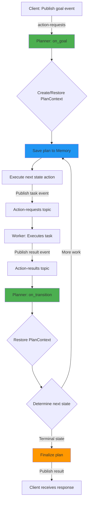
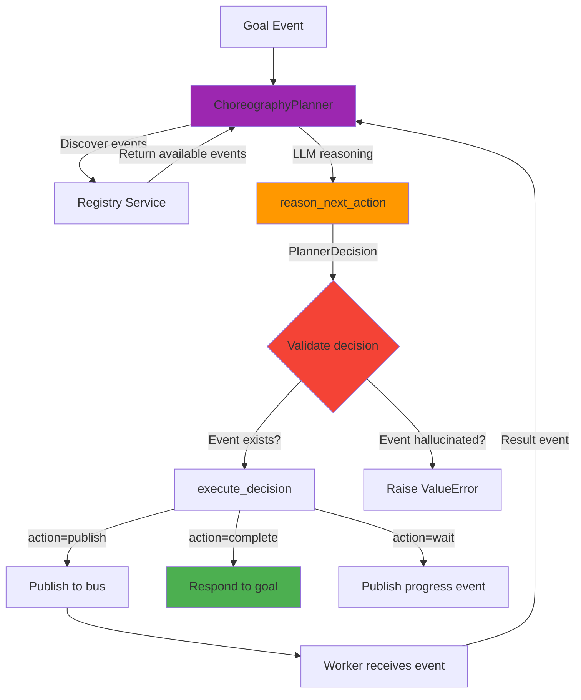

# Master Plan: Stage 4 - Planner Model (SOOR-PLAN-001)

**Status:** � In Progress (Phase 2 Complete)  
**Created:** February 16, 2026  
**Updated:** February 21, 2026 (Phase 2 completed)  
**Stage:** 4 (Agent Models - Planner)  
**Estimated Duration:** 10-12 days  
**Dependencies:** Stage 1 (Events), Stage 2 (Memory), Stage 3 (Worker)

---

## 1. Executive Summary & Problem Statement

### Current Bottleneck

The Planner agent type is currently incomplete and lacks critical orchestration capabilities:

1. **No State Machine:** Planner creates plans and publishes all tasks immediately, with no support for:
   - Dynamic plan generation with LLM reasoning
   - Event-based state transitions
   - Result aggregation across events
   - Pause/resume for HITL workflows

2. **Excessive Boilerplate:** The `research-advisor` example has ~400 lines of orchestration code:
   - Manual event discovery from Registry
   - Custom LLM prompt construction
   - Manual decision parsing and validation
   - Manual event publishing logic
   - Manual circuit breaker implementation

3. **No Type Safety:** LLM decisions return raw dictionaries (`Dict[str, Any]`):
   - No validation that events exist before publishing
   - LLM can hallucinate non-existent events
   - No structured observability fields

4. **No Tracker Service:** Progress tracking uses placeholder API calls instead of event-driven observability.

### Impact on Developer Experience

- **High complexity:** ~400 lines of boilerplate per planner
- **Error-prone:** Manual validation, no type safety
- **Poor observability:** No unified progress tracking
- **Hard to learn:** Complex patterns not abstracted into SDK

### How This Enhancement Helps

After Stage 4, developers can:

```python
# BEFORE (400+ lines of boilerplate)
# Manual discovery, LLM calls, validation, publishing...

# AFTER (20 lines with ChoreographyPlanner)
from soorma.ai.choreography import ChoreographyPlanner
from soorma.plan_context import PlanContext

planner = ChoreographyPlanner(name="orchestrator", reasoning_model="gpt-4o")

@planner.on_goal("research.goal")
async def handle_goal(goal, context):
  plan = await PlanContext.create_from_goal(
    goal=goal,
    context=context,
    state_machine={},
    current_state="reasoning",
    status="running",
  )
    decision = await planner.reason_next_action(
        trigger=f"New goal: {goal.data['objective']}",
        context=context,
    )
  await planner.execute_decision(decision, context, goal_event=goal, plan=plan)
```

**Key Benefits:**
- **95% less code:** 400 lines → 20 lines
- **Type safety:** PlannerDecision model with validation
- **No hallucinations:** SDK validates events exist before publishing
- **Built-in observability:** Automatic progress tracking via Tracker Service
- **Re-entrant plans:** Support for long-running conversations with pause/resume

---

## 2. Design Decisions & Clarifications

### 2.1 State Machine Simplification (Feedback #1)

**Question:** Can we simplify the state machine by reusing PlanContext instead of duplicating states?

**Answer:** Yes! The state machine design already follows this pattern:

```python
# SIMPLIFIED PATTERN (implemented in PlanContext)
@planner.on_goal("research.goal")
async def handle_goal(goal, context):
    # Create OR restore plan (supports re-entrant plans)
    plan = await PlanContext.restore_by_correlation(goal.correlation_id, context)
    if not plan:
    plan = await PlanContext.create_from_goal(
      goal=goal,
      context=context,
      state_machine={...},
      current_state="start",
      status="pending",
    )
    await plan.execute_next()  # Start first state

@planner.on_transition()
async def handle_transition(event, context):
    # ALWAYS restore plan first (no duplication)
    plan = await PlanContext.restore_by_correlation(event.correlation_id, context)
    if not plan:
        return  # Not a plan-related event
    
    # Determine next state based on received event
    next_state = plan.get_next_state(event)
    if next_state:
        await plan.execute_next(trigger_event=event)
    elif plan.is_complete():
        await plan.finalize()
```

**Key Simplifications:**
- Single `restore()` call in `on_transition` (no duplicate states)
- `get_next_state(event)` handles event-driven routing
- `execute_next()` reused for both initial and transition states
- State machine config defines transitions declaratively (no code duplication)

**Result:** Clean separation - PlanContext owns state logic, handlers just restore and delegate.

---

### 2.2 Planner vs ChoreographyPlanner (Feedback #2)

**Question:** Why create ChoreographyPlanner instead of updating base Planner? Backward compatibility is NOT a concern pre-launch.

**Answer:** Separation of concerns - two distinct use cases:

#### Base Planner (Low-Level Primitives)
**For:** Rule-based planning, custom logic, full control

```python
# Developer writes ALL planning logic
planner = Planner(name="order-processor")

@planner.on_goal("order.goal")
async def plan_order(goal, context):
    # Manual logic: decide states based on order type
    if goal.data["order_type"] == "standard":
        state_machine = standard_flow
    else:
        state_machine = express_flow
    
    plan = await PlanContext.create_from_goal(
      goal=goal,
      context=context,
      state_machine=state_machine,
      current_state="start",
      status="pending",
    )
    await plan.execute_next()

@planner.on_transition()
async def handle(event, context):
    # Manual state transitions
    plan = await PlanContext.restore(...)
    # Custom routing logic here
```

**Use Cases:**
- Deterministic workflows (e.g., approval chains)
- Rule-based routing (if-then logic)
- Compliance-driven flows (auditable state machines)
- When LLM cost/latency is unacceptable

#### ChoreographyPlanner (High-Level Autonomous)
**For:** LLM-based autonomous planning, minimal code

```python
# SDK handles discovery, LLM calls, validation
planner = ChoreographyPlanner(
    name="research-advisor",
    reasoning_model="gpt-4o",  # Developer's choice
)

@planner.on_goal("research.goal")
async def handle(goal, context):
  plan = await PlanContext.create_from_goal(
    goal=goal,
    context=context,
    state_machine={},
    current_state="reasoning",
    status="running",
  )
    # SDK does: discover events, LLM reasoning, validation
    decision = await planner.reason_next_action(
        trigger=f"New goal: {goal.data['objective']}",
        context=context,
    )
  await planner.execute_decision(decision, context, goal_event=goal, plan=plan)
```

**Use Cases:**
- Autonomous workflows (LLM decides next steps)
- Adaptive planning (changes based on results)
- Complex reasoning (multi-step with branching)
- Rapid prototyping (minimal code)

**Design Philosophy:**
- **Planner = Low-level toolkit** (for experts who want control)
- **ChoreographyPlanner = High-level abstraction** (for developers who want autonomy)
- Both use PlanContext internally
- ChoreographyPlanner extends Planner (inheritance or composition TBD during implementation)

**Benefits of Separation:**
1. **Clarity:** Developer intent is clear (rule-based vs autonomous)
2. **Flexibility:** Support both paradigms without compromise
3. **Learning curve:** Beginners use ChoreographyPlanner, experts use Planner
4. **Evolution:** Future planners (e.g., HybridPlanner) can mix approaches

---

### 2.3 BYO LLM Model Flexibility (Feedback #3)

**Critical Requirement:** Soorma-core MUST NOT dictate LLM provider or bear costs.

**Design Principles:**
1. **Developer controls LLM selection** via API keys in environment
2. **Developer bears costs** for LLM usage
3. **Framework is LLM-agnostic** (uses LiteLLM for abstraction)
4. **No framework-provided API keys** (developer BYOK - Bring Your Own Key)

**Implementation in ChoreographyPlanner:**

```python
class ChoreographyPlanner:
    def __init__(
        self,
        name: str,
        reasoning_model: str = "gpt-4o",  # Developer specifies
        api_key: Optional[str] = None,    # Optional override
        api_base: Optional[str] = None,   # For custom endpoints
        temperature: float = 0.7,
        **llm_kwargs,  # Pass-through to LiteLLM
    ):
        """
        Initialize ChoreographyPlanner with BYO model.
        
        Args:
            reasoning_model: Model identifier (e.g., "gpt-4o", "claude-3-opus", "ollama/llama2")
            api_key: Optional API key (defaults to OPENAI_API_KEY, ANTHROPIC_API_KEY env vars)
            api_base: Optional custom endpoint (e.g., for Azure OpenAI)
            **llm_kwargs: Additional LiteLLM parameters (max_tokens, top_p, etc.)
        
        Supported Models (via LiteLLM):
        - OpenAI: gpt-4o, gpt-4-turbo, gpt-3.5-turbo
        - Anthropic: claude-3-opus, claude-3-sonnet
        - Azure OpenAI: azure/<deployment_name>
        - Open Source: ollama/llama2, ollama/mistral
        - Vertex AI: vertex_ai/<model>
        
        API Key Priority:
        1. api_key parameter
        2. Environment variables (OPENAI_API_KEY, ANTHROPIC_API_KEY, etc.)
        3. If none: raises ValueError with helpful message
        """
        self.reasoning_model = reasoning_model
        self.api_key = api_key
        self.api_base = api_base
        self.llm_kwargs = llm_kwargs
    
    async def reason_next_action(self, ...):
        # Use LiteLLM completion() with developer's credentials
        response = completion(
            model=self.reasoning_model,
            api_key=self.api_key,  # Developer's key
            api_base=self.api_base,  # Optional custom endpoint
            messages=[...],
            **self.llm_kwargs,
        )
```

**Example Usage Patterns:**

```python
# Pattern 1: Environment variable (recommended)
# Developer sets: export OPENAI_API_KEY=sk-...
planner = ChoreographyPlanner(
    name="advisor",
    reasoning_model="gpt-4o",  # Uses OPENAI_API_KEY from env
)

# Pattern 2: Explicit API key
planner = ChoreographyPlanner(
    name="advisor",
    reasoning_model="gpt-4o",
    api_key=os.environ["MY_CUSTOM_KEY"],
)

# Pattern 3: Azure OpenAI
planner = ChoreographyPlanner(
    name="advisor",
    reasoning_model="azure/my-gpt4-deployment",
    api_base="https://my-resource.openai.azure.com",
    api_key=os.environ["AZURE_API_KEY"],
)

# Pattern 4: Local Ollama (no API key needed)
planner = ChoreographyPlanner(
    name="advisor",
    reasoning_model="ollama/llama2",  # Free, local
)

# Pattern 5: Custom LLM parameters
planner = ChoreographyPlanner(
    name="advisor",
    reasoning_model="claude-3-opus",
    max_tokens=4000,
    top_p=0.9,
)
```

**Documentation Requirements:**
- README clearly states: "Soorma-core requires developer-provided LLM credentials"
- Examples show environment variable setup
- Error messages guide developers to set API keys
- LiteLLM compatibility matrix documented

**No Framework Lock-In:**
- Developers can switch models without code changes (just env vars)
- Supports all LiteLLM-compatible providers (50+ models)
- No Soorma-managed API keys or billing

---

### 2.4 Deferred Work Tracking (Feedback #4)

**Question:** How do we track deferred items so they don't get lost?

**Answer:** Multi-level tracking strategy:

#### 1. Refactoring Index Update
Update [docs/refactoring/README.md](../../refactoring/README.md) with deferred items:

```markdown
### Stage 4: Agent Models - Planner 🟡

**Status:** ✅ Core Complete | 🟡 Enhancements Deferred

**Completed:**
- ✅ RF-SDK-006: PlanContext state machine
- ✅ RF-SDK-015: PlannerDecision types
- ✅ RF-SDK-016: ChoreographyPlanner class
- ✅ RF-ARCH-010: Tracker Service (basic)
- ✅ RF-ARCH-011: Task progress model

**Deferred to Stage 5+:**
- 🟡 RF-SDK-017: EventSelector utility → Stage 5 (Discovery)
- 🟡 RF-SDK-018: EventToolkit.format_for_llm_selection() → Stage 5
- 🟡 Advanced conditional transitions → Stage 5 or 6
- 🟡 Tracker Service UI → Post-launch (FDE: curl/Postman for now)
```

#### 2. Create DEFERRED_WORK.md
New file: `docs/refactoring/DEFERRED_WORK.md`

```markdown
# Deferred Work Tracking

Items deferred during refactoring for future implementation.

## Stage 4 Deferrals (February 2026)

### RF-SDK-017: EventSelector Utility
**Reason:** Lower priority than ChoreographyPlanner  
**Target:** Stage 5 (Discovery)  
**Effort:** 1-2 days  
**Dependencies:** Registry discovery API  

### Advanced Conditional Transitions
**Reason:** Simple transitions sufficient for MVP  
**Target:** Stage 6 or post-launch  
**Effort:** 2-3 days  
**Requirements:**
- Condition expressions (e.g., `if error_count > 3, retry_state`)
- Condition evaluation engine
- State machine validation
```

#### 3. GitHub Issues (for post-launch)
Create issues for deferred work:
- Issue #XX: "Implement EventSelector utility for LLM-based routing"
- Issue #YY: "Add conditional transitions to PlanContext state machine"
- Issue #ZZ: "Build Tracker Service UI for plan visualization"

**Tracking Process:**
1. During implementation: Note deferrals in phase commit messages
2. End of stage: Update refactoring README with deferred list
3. Document in DEFERRED_WORK.md with context
4. Create GitHub issues for visibility (labels: `enhancement`, `deferred`)
5. Revisit during next stage planning

---

## 3. Target Architecture

### Impact Map

| Component | Change Type | Files Affected |
|-----------|-------------|----------------|
| **SDK** | Major Enhancements | `sdk/python/soorma/` (7 files) |
| **soorma-common** | New DTOs | `libs/soorma-common/soorma_common/` (2 files) |
| **Tracker Service** | New Service | `services/tracker/` (new) |
| **Examples** | Refactor | `examples/research-advisor/` |

### Visual Flow: Planner State Machine



**Key Flow Points:**
1. **on_goal:** Initial goal triggers plan creation
2. **State Machine:** Each state publishes events and transitions based on results
3. **on_transition:** ALL events routed through transition handler
4. **Memory Persistence:** Plan state survives across event boundaries
5. **Terminal States:** Completion triggers final result publication

### Visual Flow: ChoreographyPlanner (Autonomous)



**Key Flow Points:**
1. **Discovery:** SDK queries Registry for available events
2. **Reasoning:** LLM selects next action from discovered events
3. **Validation:** SDK prevents hallucinated events
4. **Execution:** Type-safe dispatch (publish/complete/wait)
5. **Re-entry:** Result events trigger new reasoning cycle

### DisCo Evolution: Trinity Pattern Complete

**Before Stage 4:**
```
Tool (Sync) ← implemented ✅
Worker (Async) ← implemented ✅
Planner (???) ← incomplete ❌
```

**After Stage 4:**
```
┌─────────────────────────────────────────────┐
│ PLANNER (Orchestration)                     │
│ - State machine execution                   │
│ - LLM-based reasoning                       │
│ - Goal decomposition                        │
│ - Progress tracking                         │
└──────────────┬──────────────────────────────┘
               │ Publishes tasks
               ▼
┌──────────────────────────────┐
│ WORKER (Domain Logic)        │
│ - Async task execution       │
│ - Delegation & aggregation   │
│ - State persistence          │
└──────────────┬───────────────┘
               │ Invokes capabilities
               ▼
┌──────────────────────────────┐
│ TOOL (Atomic Ops)            │
│ - Synchronous functions      │
│ - Stateless operations       │
└──────────────────────────────┘
```

**DisCo Trinity Relationships:**
- **Planner → Worker:** Publishes goal-derived tasks
- **Worker → Tool:** Invokes stateless capabilities
- **Worker → Planner:** Reports results via events
- **All → Registry:** Discover capabilities
- **All → Memory:** Persist/restore context
- **All → Tracker:** Progress events (Stage 4)

---

## 3. Phased Roadmap

### Phase 1: Foundation - State Machine & DTOs (Days 1-4) ✅ COMPLETE

**Goal:** Implement PlanContext state machine and common DTOs

**Tasks:**
- ✅ **Already Complete:** StateConfig, StateTransition, StateAction DTOs in soorma-common (Stage 2)
- [x] **RF-SDK-006.1:** PlanContext class with state machine methods ✅ COMPLETE
  - `save()`, `restore()`, `restore_by_correlation()` ✅
  - `get_next_state(event)` - event-driven transitions ✅
  - `execute_next(trigger_event)` - dispatch actions ✅
  - `finalize(result)` - complete plan with response_event ✅
  - `pause()`, `resume()` - HITL support ✅
- [x] **RF-SDK-006.2:** Planner decorators ✅ COMPLETE
  - `on_goal(event_type)` - goal handler ✅
  - `on_transition()` - state transition handler ✅
- [x] **RF-SDK-023:** Handler-only event registration ✅ COMPLETE
  - Only register events that have handlers ✅
  - Do not populate events from structured capabilities ✅
  - Never treat topics as event types ✅

**Deliverables:**
- ✅ `sdk/python/soorma/plan_context.py` - PlanContext class (~450 lines)
- ✅ `sdk/python/soorma/agents/planner.py` - Updated decorators (~200 lines added)
- ✅ Unit tests: `tests/agents/test_plan_context.py` (19 passing tests)
- ✅ Unit tests: `tests/test_planner.py` (11 passing tests)
- ✅ Integration test: `tests/agents/test_planner_integration.py` (1 passing test)
- ✅ Test Coverage: 80% overall (86% PlanContext, 74% Planner)
- ✅ CHANGELOG updated with Phase 1 features

**Dependencies:** ✅ Stage 2 (Memory SDK complete)

**Completion Criteria:**
- [x] PlanContext persists and restores from Memory Service ✅
- [x] State transitions work based on incoming events ✅
- [x] on_goal creates PlanContext and executes first state ✅
- [x] on_transition routes events to plans by correlation_id ✅
- [x] All tests pass (31 tests total) ✅

**Completion Date:** February 18, 2026

---

### Phase 2: Implementation - Type-Safe Decisions (Days 5-7) ✅ COMPLETE

**Goal:** Add PlannerDecision types and ChoreographyPlanner class

**Tasks:**
- [x] **RF-SDK-015:** PlannerDecision and PlanAction types ✅
  - PlanAction enum: PUBLISH, COMPLETE, WAIT, DELEGATE
  - PlannerDecision Pydantic model with validation
  - `model_json_schema()` for LLM prompts
- [x] **RF-SDK-016:** ChoreographyPlanner class ✅
  - `reason_next_action()` - LLM-based decision making with custom_context parameter
  - `execute_decision()` - type-safe execution
  - `_build_prompt()` - schema-based prompts with system_instructions and custom_context
  - `_get_strategy_guidance()` - planning strategies (balanced/conservative/aggressive)
  - Circuit breaker (max_actions)
  - Event validation (prevent hallucinations)
- [x] **Enhancement 1:** System Instructions (business logic injection) ✅
  - system_instructions parameter in __init__()
  - planning_strategy parameter (balanced|conservative|aggressive)
  - Integration into prompt generation
- [x] **Enhancement 2:** Runtime Custom Context ✅
  - custom_context parameter in reason_next_action()
  - Dynamic context injection per decision
  - JSON serialization in prompts
- [x] **Bonus:** PlanContext.create_from_goal() utility method ✅
  - Standardizes plan creation from goal events
  - Automatic plan persistence

**Deliverables:**
- ✅ `libs/soorma-common/src/soorma_common/decisions.py` - PlannerDecision types (150 lines)
- ✅ `sdk/python/soorma/ai/choreography.py` - ChoreographyPlanner (450 lines with enhancements)
- ✅ `sdk/python/soorma/plan_context.py` - create_from_goal() added
- ✅ Unit tests: `tests/test_decisions.py` (16 tests passing)
- ✅ Unit tests: `tests/test_choreography.py` (25 tests passing)
- ✅ Unit tests: `tests/test_plan_context.py` (6 new tests for create_from_goal)
- ✅ Integration tests: `tests/test_choreography_integration.py` (4 tests passing)
- ✅ Documentation: SESSION_INITIALIZATION.md (TDD enforcement guide)

**Dependencies:** ✅ Phase 1 (PlanContext complete)

**Completion Criteria:**
- [x] PlannerDecision validates all action types ✅
- [x] ChoreographyPlanner discovers events from Registry ✅
- [x] LLM decisions use schema-based prompts ✅
- [x] system_instructions parameter enables business logic injection ✅
- [x] custom_context parameter enables runtime dynamic context ✅
- [x] Planning strategies (conservative/balanced/aggressive) work correctly ✅
- [x] Event validation prevents hallucinated events ✅
- [x] Circuit breaker prevents runaway workflows ✅
- [x] All tests pass (51 tests, exceeded goal of 25+) ✅
- [x] Two-layer SDK architecture verified ✅
- [x] CHANGELOG.md updated (SDK + soorma-common) ✅

**Completion Date:** February 21, 2026  
**Actual Duration:** 2 days (estimated 3 days)

---

### Phase 3: Validation - Examples & Tracker Service (Days 8-10)

**Goal:** Update examples and implement Tracker Service

**Tasks:**
- [ ] **Example Refactor:** Update `research-advisor`
  - Replace manual orchestration with ChoreographyPlanner
  - Reduce from ~400 lines → ~50 lines
  - Demonstrate state machine patterns
  - Show pause/resume HITL
- [ ] **RF-ARCH-010:** Tracker Service implementation
  - Event listeners (system-events, action-requests, action-results)
  - Progress storage (plan_progress, task_progress tables)
  - Read-only query APIs
- [ ] **RF-ARCH-011:** Task progress model
  - TaskProgressEvent schema in soorma-common
  - TaskStateChanged schema in soorma-common

**Deliverables:**
- `examples/research-advisor/planner.py` - Refactored (~50 lines, down from ~400)
- `services/tracker/` - New service (~600 lines total)
- `libs/soorma-common/soorma_common/tracker.py` - Event schemas (~100 lines)
- Integration tests: `test/integration/test_planner_flow.py` (~150 lines)

**Dependencies:** Phase 2 (ChoreographyPlanner complete)

**Completion Criteria:**
- [ ] research-advisor uses ChoreographyPlanner
- [ ] Tracker Service subscribes to events
- [ ] Progress events stored in database
- [ ] Query APIs return plan/task timelines
- [ ] Integration tests pass (5+ tests)
- [ ] Example runs end-to-end with `soorma dev`

---

### Phase 4: Polish - Documentation & Migration (Days 11-12)

**Goal:** Update all documentation and create migration guide

**Tasks:**
- [ ] Update `docs/agent_patterns/README.md`
  - Add Planner pattern examples
  - Add ChoreographyPlanner usage
  - Update pattern catalog
- [ ] Update `docs/agent_patterns/ARCHITECTURE.md`
  - Document PlanContext design
  - Document ChoreographyPlanner architecture
  - Update implementation status
- [ ] Update `docs/refactoring/README.md`
  - Mark Stage 4 complete
  - Update completion status
- [ ] Create `docs/refactoring/sdk/09-PLANNER-MIGRATION.md`
  - Before/after code examples
  - Breaking changes list
  - Migration steps
- [ ] Update `CHANGELOG.md` in SDK and soorma-common
- [ ] Update example READMEs

**Deliverables:**
- Updated documentation (6 files)
- Migration guide (1 file)
- Updated CHANGELOGs (2 files)

**Completion Criteria:**
- [ ] All documentation reflects new Planner model
- [ ] Migration guide complete with examples
- [ ] CHANGELOG entries added
- [ ] Documentation review complete

---

## 4. Risks & Constraints

### Technical Risks

| Risk | Likelihood | Impact | Mitigation |
|------|------------|--------|------------|
| LLM hallucinations cause invalid events | High | High | Event validation in ChoreographyPlanner |
| State machine complexity | Medium | Medium | Start with simple examples, add complexity iteratively |
| Memory Service performance | Low | Medium | Use indexes on plan_id, correlation_id |
| Tracker Service lag | Low | Low | Async event processing, no blocking |

### MIT Compliance

✅ **All dependencies are MIT/Apache/BSD:**
- litellm (Apache 2.0)
- Pydantic (MIT)
- FastAPI (MIT)
- PostgreSQL (PostgreSQL License - permissive)

No proprietary dependencies introduced.

### 48-Hour Filter: FDE Opportunities

| Component | Full Implementation | FDE Alternative | Decision |
|-----------|---------------------|-----------------|----------|
| **Tracker Service** | Postgres + subscribers + REST API (3 days) | Log to console + JSON files (4 hours) | **Build Full** - Core observability need |
| **State Machine** | Full StateConfig model with conditions (2 days) | Simple string-based transitions (8 hours) | **Build Full** - Critical for flexibility |
| **ChoreographyPlanner** | Full LLM integration + validation (2 days) | Manual event selection (4 hours) | **Build Full** - Key DX improvement |

**Rationale for building full implementations:**
- **Tracker:** Observability is critical for debugging multi-agent systems
- **State Machine:** Flexibility needed for complex workflows (conditional transitions)
- **ChoreographyPlanner:** This is THE innovation - reducing 400 lines to 20 lines

**Possible FDE for Phase 4+ (if timeline pressure):**
- **UI for Tracker:** Defer UI, use API queries with `curl` or Postman
- **Advanced state machine features:** Defer conditional transitions to Phase 5
- **EventSelector utility (RF-SDK-017, 018):** Defer to Stage 5

---

## 5. Test Strategy (TDD Approach)

### Unit Tests

**PlanContext (test_plan_context.py):**
```python
async def test_plan_context_save_calls_memory()
async def test_plan_context_restore_by_correlation()
async def test_get_next_state_with_transitions()
async def test_execute_next_publishes_action()
async def test_finalize_uses_response_event()
async def test_pause_sets_status()
async def test_resume_continues_execution()
```

**Planner Decorators (test_planner.py):**
```python
async def test_on_goal_creates_plan_context()
async def test_on_goal_executes_first_state()
async def test_on_transition_routes_by_correlation()
async def test_on_transition_ignores_unknown_plans()
async def test_handler_only_registration()  # RF-SDK-023
```

**PlannerDecision (test_decisions.py):**
```python
def test_planner_decision_publish_validates()
def test_planner_decision_complete_requires_result()
def test_planner_decision_model_json_schema()
def test_plan_action_enum_values()
```

**ChoreographyPlanner (test_choreography.py):**
```python
async def test_reason_next_action_discovers_events()
async def test_reason_next_action_calls_llm()
async def test_reason_next_action_validates_event_exists()
async def test_reason_next_action_raises_on_hallucination()
async def test_execute_decision_publish()
async def test_execute_decision_complete()
async def test_execute_decision_wait()
async def test_circuit_breaker_max_actions()
```

### Integration Tests

**End-to-End Flow (test_planner_flow.py):**
```python
async def test_goal_to_completion_with_state_machine()
async def test_choreography_planner_autonomous_flow()
async def test_pause_resume_with_hitl()
async def test_tracker_records_progress()
async def test_nested_plans_with_parent_plan_id()
```

### Test Coverage Goals

- **Unit Tests:** 90%+ coverage
- **Integration Tests:** Critical paths covered
- **Total Tests:** 40+ tests across all components

---

## 6. Success Metrics

### Quantitative Metrics

- [ ] **Code Reduction:** research-advisor planner: 400 lines → 50 lines (87.5% reduction)
- [ ] **Test Coverage:** 90%+ on new code
- [ ] **Test Count:** 40+ tests passing
- [ ] **API Response Time:** Tracker queries <100ms
- [ ] **Memory Overhead:** PlanContext storage <10KB per plan

### Qualitative Metrics

- [ ] **Developer Experience:** New planner creation takes <30 minutes
- [ ] **Documentation Quality:** Developer can follow examples without external help
- [ ] **Type Safety:** No runtime errors from hallucinated events
- [ ] **Observability:** Complete plan execution timeline visible in Tracker

---

## 7. Implementation Checklist

### Pre-Implementation (Done Week 1)
- [x] Read AGENT.md, templates, refactoring docs
- [x] Review existing planner.py code
- [x] Review research-advisor example
- [ ] **THIS DOCUMENT:** Commit Master Plan for review
- [ ] Developer approval to proceed

### Phase 1: Foundation (Days 1-4)
- [ ] TDD: Write PlanContext tests (RED)
- [ ] Implement PlanContext class (GREEN)
- [ ] Refactor PlanContext (REFACTOR)
- [ ] TDD: Write Planner decorator tests (RED)
- [ ] Implement on_goal and on_transition (GREEN)
- [ ] Refactor Planner decorators (REFACTOR)
- [ ] Update CHANGELOG.md (SDK)
- [ ] Commit: "feat(sdk): Implement PlanContext state machine (RF-SDK-006)"

### Phase 2: Implementation (Days 5-7)
- [ ] TDD: Write PlannerDecision tests (RED)
- [ ] Implement PlannerDecision and PlanAction (GREEN)
- [ ] TDD: Write ChoreographyPlanner tests (RED)
- [ ] Implement ChoreographyPlanner class (GREEN)
- [ ] Refactor ChoreographyPlanner (REFACTOR)
- [ ] Update CHANGELOG.md (SDK)
- [ ] Commit: "feat(sdk): Add ChoreographyPlanner for autonomous orchestration (RF-SDK-015, 016)"

### Phase 3: Validation (Days 8-10)
- [ ] Refactor research-advisor planner with ChoreographyPlanner
- [ ] TDD: Write Tracker Service tests (RED)
- [ ] Implement Tracker subscribers and storage (GREEN)
- [ ] Implement Tracker query APIs (GREEN)
- [ ] Add progress event schemas to soorma-common
- [ ] Write integration tests
- [ ] Update CHANGELOG.md (Tracker Service, soorma-common)
- [ ] Commit: "feat(services): Implement Tracker Service for observability (RF-ARCH-010, 011)"

### Phase 4: Polish (Days 11-12)
- [ ] Update docs/agent_patterns/README.md
- [ ] Update docs/agent_patterns/ARCHITECTURE.md
- [ ] Update docs/refactoring/README.md
- [ ] Create docs/refactoring/sdk/09-PLANNER-MIGRATION.md
- [ ] Update example READMEs
- [ ] Final test run (all 40+ tests passing)
- [ ] Commit: "docs: Complete Stage 4 Planner implementation documentation"
- [ ] Tag release: v0.8.0

---

## 8. Dependencies & Coordination

### Upstream Dependencies (Must be complete)

- ✅ **Stage 1 (Events):** Event system with response_event, create_child_request
- ✅ **Stage 2 (Memory):** Memory SDK with save_plan_context, get_plan_context
- ✅ **Stage 2.1 (Memory Enhancements):** Working memory deletion, semantic privacy
- ✅ **Stage 3 (Worker):** Worker model as pattern reference

### Downstream Enablement (Unblocks)

- **Stage 5 (Discovery):** EventSelector utility (RF-SDK-017, 018)
- **Examples Phase 4:** 08-planner-worker-basic, 09-app-research-advisor

### Service ↔ SDK Coordination

| Service Component | SDK Component | Coordination Point |
|-------------------|---------------|-------------------|
| Memory Service (existing) | PlanContext.save/restore | Plan persistence schema |
| Tracker Service (new) | ChoreographyPlanner | Progress event schemas |
| Registry Service (existing) | ChoreographyPlanner.reason_next_action | Event discovery API |

**Coordination Strategy:**
1. **Phase 1:** SDK-only (uses existing Memory Service)
2. **Phase 2:** SDK-only (uses existing Registry Service)
3. **Phase 3:** Add Tracker Service + update SDK to emit events

---

## 9. Related Documents

### Refactoring Plans (Primary Reference)
- [docs/refactoring/sdk/06-PLANNER-MODEL.md](../../refactoring/sdk/06-PLANNER-MODEL.md) - Planner state machine design
- [docs/refactoring/arch/04-TRACKER-SERVICE.md](../../refactoring/arch/04-TRACKER-SERVICE.md) - Tracker service design
- [docs/refactoring/sdk/03-COMMON-DTOS.md](../../refactoring/sdk/03-COMMON-DTOS.md) - StateConfig DTOs
- [docs/refactoring/README.md](../../refactoring/README.md) - Stage 4 overview

### Architecture Documentation
- [docs/agent_patterns/ARCHITECTURE.md](../ARCHITECTURE.md) - Agent model designs
- [docs/agent_patterns/README.md](../README.md) - Pattern catalog
- [ARCHITECTURE.md](../../../ARCHITECTURE.md) - Platform architecture

### Standards
- [AGENT.md](../../../AGENT.md) - Developer constitution
- [docs/CONTRIBUTING_REFERENCE.md](../../CONTRIBUTING_REFERENCE.md) - Technical reference
- [docs/templates/Master_Plan_Template.md](../../templates/Master_Plan_Template.md) - This template

---

## 10. Developer Decisions (February 17, 2026)

### Q1: Tracker Service Scope
**Question:** Full Postgres implementation or console logging FDE?  
**Decision:** ✅ **Full implementation** - critical for observability  
**Rationale:** Tracker is core to multi-agent debugging and observability  
**Impact:** Phase 3 proceeds as planned  

### Q2: Conditional Transitions
**Question:** Support conditional state transitions in Phase 1?  
**Decision:** 🟡 **Defer complex conditions, document requirements**  
**Rationale:** Simple event-based transitions sufficient for MVP  
**Impact:** Document conditional transition requirements in DEFERRED_WORK.md  
**Future Work:** Stage 5 or 6 can add condition expressions  

```python
# MVP (Stage 4): Simple event-based transitions
StateTransition(on_event="task.failed", to_state="retry")

# Future (Stage 5+): Conditional transitions
StateTransition(
    on_event="task.failed",
    to_state="retry",
    condition="retry_count < 3"  # ← Deferred
)
```

### Q3: EventSelector Utility
**Question:** Implement EventSelector (RF-SDK-017, 018) in Stage 4?  
**Decision:** 🟡 **Defer to Stage 5, document requirements**  
**Rationale:** ChoreographyPlanner is higher priority for DX impact  
**Impact:** EventSelector moved to Stage 5 (Discovery) roadmap  
**Future Work:** Document in DEFERRED_WORK.md with use cases  
**Note:** ✅ EventToolkit already exists (provides discovery/formatting foundation), reducing EventSelector effort to 0.5-1 day  

### Q4: Testing Strategy
**Question:** 40+ tests sufficient or target 50+?  
**Decision:** ✅ **Expand as needed during Action Plan reviews**  
**Rationale:** Start with 40, add tests as implementation uncovers edge cases  
**Impact:** Flexible test expansion based on complexity  

---

## 11. Deferred Work Documentation

**Created:** DEFERRED_WORK.md tracking file  
**Updated:** Refactoring README with deferred items list  
**Tracked:** GitHub issues for post-Stage 4 enhancements  

**Deferred Items from Stage 4:**
1. ✅ RF-SDK-017: EventSelector utility → Stage 5 (0.5-1 day, EventToolkit foundation exists)
2. ✅ RF-SDK-018: EventToolkit helpers → ✅ Already exists (format_for_llm, format_as_prompt_text)
3. ✅ Conditional state transitions → Stage 5 or 6
4. ✅ Tracker Service UI → Post-launch FDE
5. 🟡 RF-SDK-019: Prompt Template System → Stage 5 or Post-launch (2-3 days)
   - Reusable templating for domain-specific prompts
   - Few-shot example integration
   - Template registry and versioning

**Enhancements Completed in Phase 2:**
1. ✅ Enhancement 1: System Instructions (business logic injection)
2. ✅ Enhancement 2: Runtime Custom Context (dynamic decision parameters)

**Remaining Enhancement (deferred):**
3. 🟡 Enhancement 3: Prompt Template System (RF-SDK-019) - see item 5 above
5. 🟡 **RF-SDK-019: Prompt Template System** → Stage 5 or Post-launch
   - **Reason:** Enhancement 3 deferred from Phase 2 for scope control
   - **Target:** Stage 5 (Discovery & Advanced Features) or Post-launch
   - **Effort:** 2-3 days
   - **Requirements:**
     - Reusable prompt templates (Jinja2 or similar)
     - Template registry for common patterns
     - Few-shot example integration
     - Template customization per domain
     - Template versioning and validation
   - **Use Cases:**
     - Financial workflows (compliance-focused templates)
     - Medical research (evidence-based templates)
     - Customer service (tone-aware templates)
     - Manufacturing (safety-first templates)
   - **Dependencies:** Phase 2 complete (system_instructions working)

---

**Status:** ✅ **Approved - Ready for Phase 1 Implementation**  
**Next Step:** Create Action Plans for each phase
