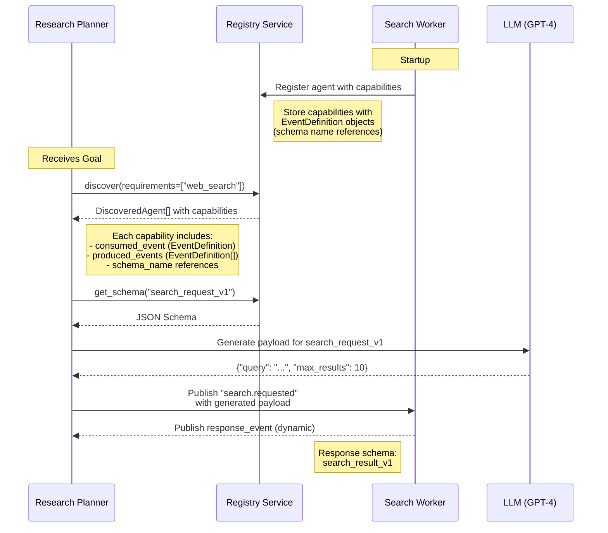

# Master Plan: Stage 5 - Discovery & A2A Integration (SOOR-DISC-001)

**Status:** 🟢 Implementation In Progress  
**Feature Area:** Discovery  
**Refactoring Stage:** Stage 5 (Phase 3)  
**Last Updated:** March 1, 2026  
**Estimated Duration:** 2-3 weeks (15 days implementation)  
**Target Release:** v0.8.1  
**Approved Scope:** Full implementation including EventSelector

### Phase Progress

| Phase | Description | Status | Completion |
|-------|-------------|--------|------------|
| Phase 1 | Foundation - Schema Registry & DTOs | ✅ Complete | March 1, 2026 (50 tests passing) |
| Phase 2 | Service Implementation | ✅ Complete | March 1, 2026 (80 tests passing) |
| Phase 3 | SDK Implementation & A2A Gateway | ✅ Complete | March 1, 2026 (49 tests passing) |
| Phase 4 | Tracker Service NATS Integration | ⬜ Not started | — |
| Phase 5 | Validation & Documentation | ⬜ Not started | — |

---

## 1. Executive Summary & Problem Statement

### Refactoring Context

**Stage 5** builds on the foundation laid in Stages 1-4:
- ✅ **Stage 1-2:** Event system, memory, and common DTOs (v0.7.5)
- ✅ **Stage 3:** Tool and Worker agent models (v0.7.7)
- ✅ **Stage 4:** Planner model with ChoreographyPlanner (v0.8.0)
- 🎯 **Stage 5:** Discovery & A2A integration (v0.8.1)

This stage enables **dynamic agent discovery** for LLM-driven choreography.

### Current Bottleneck

The existing Registry Service (Stages 0-4) provides **basic agent and event registration** but lacks advanced discovery capabilities:

**Limitation 1: Schema-Event Coupling (RF-ARCH-005)**
- Events registered with embedded JSON schemas tied to event names
- Dynamic `response_event` names (caller-specified) have no discoverable payload structure
- LLM agents cannot generate valid payloads for discovered capabilities
- **Impact:** Blocks ChoreographyPlanner from using discovered agents dynamically

**Limitation 2: Flat Capability Model (RF-ARCH-006)**
- Capabilities are simple JSON objects with event type strings
- No full `EventDefinition` objects with schema references
- Missing metadata for LLM-based agent selection
- **Impact:** Limits intelligent routing and delegation

**Limitation 3: Limited Discovery API (RF-ARCH-007, RF-SDK-008)**
- `query_agents()` returns basic agent info without event schemas
- No capability-based filtering with full schema metadata
- Cannot discover "all agents that can perform web research" with payload requirements
- **Impact:** Requires hardcoded event types, reduces flexibility

**Limitation 4: No Multi-Tenancy Enforcement**
- Registry Service lacks Row-Level Security (RLS) policies
- Agent/event data not isolated by tenant_id
- **Impact:** Security vulnerability, potential cross-tenant data leakage

**Limitation 5: Architectural Tech Debt**
- Tracker Service uses EventClient (SDK layer) instead of direct NATS
- Violates architectural pattern (infrastructure services should use NATS directly)
- **Impact:** Unnecessary dependency coupling, complicates deployment

### Target Outcome

**For Agent Developers:**
- Register agents with structured capabilities including full event schemas
- Discover agents by capability with complete payload schema information
- Enable LLM agents (ChoreographyPlanner) to dynamically select and invoke discovered capabilities
- Use EventSelector for intelligent routing based on natural language criteria

**For the Platform:**
- Decouple payload schemas from event names (schema registry pattern)
- Enforce multi-tenant isolation in Registry Service
- Provide rich discovery metadata for LLM-based choreography
- Fix architectural tech debt in Tracker Service

### Refactoring Task Index

This stage implements the following tasks from the refactoring roadmap:

| Task ID | Description | Component | Priority |
|---------|-------------|-----------|----------|
| **RF-ARCH-005** | Schema registration by name (not event name) | Registry Service | 🔴 Critical |
| **RF-ARCH-006** | Structured capabilities with EventDefinition | Registry Service | 🔴 Critical |
| **RF-ARCH-007** | Enhanced discovery API for LLM reasoning | Registry Service | 🔴 Critical |
| **RF-SDK-007** | Event registration tied to agent startup | SDK Registry Client | 🟡 High |
| **RF-SDK-008** | Agent discovery by capability (A2A alignment) | SDK Registry Client | 🟡 High |
| **RF-SDK-017** | EventSelector utility (deferred from Stage 4) | SDK AI Module | 🟢 Medium |
| **TECH-DEBT-001** | Tracker Service NATS direct integration | Tracker Service | 🔴 Critical |

**Reference Documents:**
- [arch/05-REGISTRY-SERVICE.md](../../refactoring/arch/05-REGISTRY-SERVICE.md)
- [sdk/07-DISCOVERY.md](../../refactoring/sdk/07-DISCOVERY.md)
- [DEFERRED_WORK.md](../../refactoring/DEFERRED_WORK.md) (RF-SDK-017, Tracker NATS)

**DisCo Pattern Enhancement:**
- **Planners:** Discover worker capabilities dynamically with LLM reasoning
- **Workers:** Register with structured capabilities including schema references
- **Tool Selection:** LLM agents generate valid payloads using discovered schemas

---

## 2. Target Architecture

### Impact Map

- **SDK:** `sdk/python/soorma/registry/client.py`, `sdk/python/soorma/context.py`
- **Common:** `libs/soorma-common/src/soorma_common/registry.py` (new DTOs)
- **Services:** `services/registry/` (database schema, API endpoints, business logic)
- **Examples:** `examples/*/` (update to demonstrate discovery patterns)

### Visual Flow



### DisCo Evolution

**Current State (Stages 0-3):**
- Hardcoded event type strings in agent code
- Manual event payload construction
- Limited runtime agent discovery

**Target State (Stage 5):**
- **Planners:** Use `context.registry.discover(requirements)` to find agents
- **Planners:** Fetch schema via `context.registry.get_schema(schema_name)` 
- **Planners:** Use LLM to generate payloads conforming to discovered schemas
- **Workers:** Register with `EventDefinition` objects (schema name references)
- **Workers:** Response payloads validated against registered schemas

---

### SDK Layer Impact Assessment

#### Service Layer (Low-Level)

**Services affected:** Registry  

**New endpoints:**
1. `POST /v1/schemas` - Register payload schema by name
2. `GET /v1/schemas/{schema_name}` - Retrieve schema by name
3. `GET /v1/schemas/{schema_name}/versions/{version}` - Retrieve specific version
4. `GET /v1/agents/discover` - Enhanced discovery with capability filtering (replaces existing `/v1/agents` query)
5. `DELETE /v1/agents/{agent_id}` - Explicit agent deregistration (cleanup on shutdown)

**Service client methods** (`RegistryServiceClient` - if we add a low-level service client):
- `register_schema(schema: PayloadSchemaRegistration) -> PayloadSchemaResponse`
- `get_schema(schema_name: str, version: Optional[str]) -> PayloadSchema`
- `discover_agents(requirements: List[str], include_schemas: bool) -> List[DiscoveredAgent]`
- `deregister_agent(agent_id: str, tenant_id: str, user_id: str) -> None`

**Note:** Currently, `RegistryClient` is already a high-level client used directly by agent code. We maintain this pattern—no separate low-level service client needed.

#### PlatformContext Layer (High-Level)

**Wrapper classes affected:** `RegistryClient` (in `sdk/python/soorma/registry/client.py`)

**Existing methods** (verify continue to work):
- `register_agent(agent: AgentDefinition) -> AgentRegistrationResponse`
- `get_agent(agent_id: str) -> Optional[AgentDefinition]`
- `query_agents(capabilities: Optional[List[str]]) -> List[AgentDefinition]`
- `heartbeat(agent_id: str) -> None`
- `register_event(event: EventDefinition) -> EventRegistrationResponse`
- `get_event(event_name: str) -> Optional[EventDefinition]`
- `get_events_by_topic(topic: str) -> List[EventDefinition]`

**New wrapper methods** (agent-friendly API):
```python
# Schema management
async def register_schema(
    self,
    schema_name: str,
    version: str,
    json_schema: Dict[str, Any],
    description: Optional[str] = None,
) -> PayloadSchemaResponse:
    """Register payload schema (tenant/user from context)."""
    pass

async def get_schema(
    self,
    schema_name: str,
    version: Optional[str] = None,
) -> Optional[PayloadSchema]:
    """Get payload schema by name."""
    pass

# Enhanced discovery
async def discover(
    self,
    requirements: List[str],
    include_schemas: bool = True,
) -> List[DiscoveredAgent]:
    """
    Discover agents by capability requirements.
    Returns agents with full capability metadata including schema references.
    """
    pass

# Explicit cleanup (optional, for graceful shutdown)
async def deregister(self, agent_id: str) -> None:
    """Explicitly deregister agent (tenant/user from context)."""
    pass
```

**Delegation pattern:**
- All methods delegate to underlying HTTP calls (no change from current pattern)
- Tenant/user context extracted from environment variables (current v0.7.x pattern)
- Methods return Pydantic models from `soorma_common`

#### Verification Strategy

- [x] **Architectural compliance verified:**
  - RegistryClient is already high-level—used directly by agent code ✅
  - No need for separate service client wrapper ✅
  - Maintains two-layer pattern principle (high-level API for agents) ✅
  
- [x] **Action Plan includes:**
  - [x] Wrapper method implementation for new discovery endpoints — `discover()`, `discover_agents()`, `get_schema()`, `register_schema()`, `list_schemas()` all implemented and tested ✅
  - [ ] Update existing examples to use `discover()` instead of `query_agents()` — **deferred to Phase 5** (examples & validation phase)
  - [x] Verify all methods include tenant/user context in headers — all `RegistryClient` methods inject `self._auth_headers` (`X-Tenant-ID`) ✅

- [ ] **Documentation Updates** — **deferred to Phase 5:**
  - [ ] Update `docs/discovery/README.md` with new discovery patterns
  - [ ] Update `docs/discovery/ARCHITECTURE.md` with schema registry design
  - [ ] Add examples to `examples/*/` demonstrating LLM-based discovery

---

## 3. Phased Roadmap

### Phase 1: Foundation - Schema Registry & DTOs (2-3 days)

**Objective:** Establish data models, database schema, and multi-tenancy

**Refactoring Tasks:** RF-ARCH-005, RF-ARCH-006 (partial)

**Deliverables:**

1. **Common Library DTOs** (`libs/soorma-common/src/soorma_common/registry.py`)
   - `PayloadSchema` - Schema definition with version
   - `PayloadSchemaRegistration` - Registration request
   - `PayloadSchemaResponse` - Registration response
   - Enhanced `EventDefinition` with `payload_schema_name` field
   - Enhanced `AgentCapability` with `EventDefinition` objects (not strings)
   - `DiscoveredAgent` - Discovery response with schema metadata

2. **Database Schema** (`services/registry/migrations/`)
   - Create `payload_schemas` table:
     - `id`, `schema_name`, `version`, `json_schema`, `owner_agent_id`
     - `tenant_id`, `user_id` (multi-tenancy)
     - `description`, `created_at`, `updated_at`
     - Unique constraint: `(schema_name, version, tenant_id)`
   - Alter `agents` table:
     - Add `tenant_id UUID NOT NULL`
     - Add `user_id UUID NOT NULL`
     - Add `version VARCHAR DEFAULT '1.0.0'` (A2A alignment)
   - Alter `events` table:
     - Add `owner_agent_id UUID REFERENCES agents(id) ON DELETE SET NULL`
     - Add `tenant_id UUID NOT NULL`
     - Add `user_id UUID NOT NULL`
   - Create Row-Level Security (RLS) policies:
     - `payload_schemas_tenant_isolation`
     - `agents_tenant_isolation`
     - `events_tenant_isolation`
   - Alembic migration script

3. **Tests:**
   - Unit tests for DTOs (Pydantic model validation)
   - Migration test (verify schema creation)
   - RLS policy tests (verify isolation)

**FDE Option:** Use embedded schemas (skip `payload_schemas` table)
- **Time Saved:** 1.5 days
- **Impact:** ❌ Critical - loses dynamic event type support (core Stage 5 value)
- **Recommendation:** Do NOT defer

---

### Phase 2: Service Implementation (3-4 days)

**Objective:** Implement Registry Service endpoints and business logic

**Refactoring Tasks:** RF-ARCH-005 (complete), RF-ARCH-006 (complete), RF-ARCH-007

**Deliverables:**

1. **Registry Service Endpoints** (`services/registry/src/registry_service/api/v1/`)
   - **Schema Management** (`schemas.py`):
     - `POST /v1/schemas` - Register payload schema (RF-ARCH-005)
     - `GET /v1/schemas/{schema_name}` - Get latest version
     - `GET /v1/schemas/{schema_name}/versions/{version}` - Get specific version
     - `GET /v1/schemas?owner_agent_id={id}` - List agent's schemas
   
   - **Enhanced Agent Registration** (`agents.py`):
     - Update `POST /v1/agents` - Accept structured capabilities (RF-ARCH-006)
     - Update `GET /v1/agents` - Return enhanced `AgentDefinition`
     - `GET /v1/agents/discover` - Capability-based discovery (RF-ARCH-007)
       - Query params: `capabilities[]`, `include_schemas`, `version`
       - Returns: `DiscoveredAgent[]` with full metadata
   
   - **Explicit Deregistration** (`agents.py`):
     - `DELETE /v1/agents/{agent_id}` - Explicit cleanup (graceful shutdown)

2. **Service Business Logic** (`services/registry/src/registry_service/services/`)
   - `schema_service.py` - CRUD for payload schemas
   - Update `agent_service.py`:
     - Handle `AgentCapability` with `EventDefinition` objects
     - Capability-based discovery with schema resolution
     - Tenant isolation enforcement
   - Update `event_service.py`:
     - Link events to owner agents
     - Schema name references (not embedded schemas)

3. **Multi-Tenancy Middleware** (`services/registry/src/registry_service/middleware/`)
   - Extract `X-Tenant-ID`, `X-User-ID` from headers
   - Set PostgreSQL session variables (`app.tenant_id`, `app.user_id`)
   - RLS policies automatically enforce isolation

4. **Tests:**
   - Service endpoint integration tests (pytest + TestClient)
     - Schema registration and retrieval
     - Agent registration with structured capabilities
     - Discovery with capability filtering
     - Multi-tenant isolation (verify cross-tenant queries fail)
   - Business logic unit tests (mock database)
   - **Target:** 60+ tests (20 schema, 25 agent, 15 discovery)

**TDD Cycle:**
- **STUB:** Create endpoint signatures with `NotImplementedError`
- **RED:** Write tests that fail with `NotImplementedError`
- **GREEN:** Implement real logic
- **REFACTOR:** Align with architecture patterns

**FDE Option:** Skip multi-tenancy RLS (use app-level filtering)
- **Time Saved:** 1 day
- **Impact:** ❌ Critical - creates security debt
- **Recommendation:** Do NOT defer

---

### Phase 3: SDK Implementation & A2A Gateway (2-3 days)

**Objective:** Implement SDK discovery methods and A2A compatibility layer

**Refactoring Tasks:** RF-SDK-007, RF-SDK-008, RF-SDK-017 (partial)

**Deliverables:**

1. **SDK Registry Client Methods** (`sdk/python/soorma/registry/client.py`)
   
   **Schema Management** (RF-SDK-007):
   ```python
   async def register_schema(
       self,
       schema_name: str,
       version: str,
       json_schema: Dict[str, Any],
       description: Optional[str] = None,
   ) -> PayloadSchemaResponse
   
   async def get_schema(
       self,
       schema_name: str,
       version: Optional[str] = None,
   ) -> Optional[PayloadSchema]
   ```
   
   **Enhanced Discovery** (RF-SDK-008):
   ```python
   async def discover(
       self,
       requirements: List[str],
       include_schemas: bool = True,
   ) -> List[DiscoveredAgent]
   
   async def deregister(self, agent_id: str) -> None
   ```
   
   **Update Existing Methods**:
   - `register_agent()` - Accept enhanced `AgentDefinition` with structured capabilities
   - Update `query_agents()` - Mark as deprecated in favor of `discover()`

2. **A2A Gateway Helper** (`sdk/python/soorma/gateway.py` - NEW)
   ```python
   class A2AGatewayHelper:
       @staticmethod
       def agent_to_card(agent: AgentDefinition, gateway_url: str) -> A2AAgentCard
       
       @staticmethod
       def task_to_event(task: A2ATask, event_type: str) -> ActionRequestEvent
       
       @staticmethod
       def event_to_response(event: ActionResultEvent, task_id: str) -> A2ATaskResponse
   ```

3. **EventSelector Utility** (`sdk/python/soorma/ai/selection.py` - NEW)
   
   **Status:** 50% complete (EventToolkit foundation exists)
   
   ```python
   class EventSelector:
       """LLM-based event selection for intelligent routing."""
       
       def __init__(
           self,
           context: PlatformContext,
           topic: str,
           prompt_template: str,
           model: str = "gpt-4o-mini",
       )
       
       async def select_event(self, state: Dict[str, Any]) -> EventDecision
       
       async def publish_decision(
           self,
           decision: EventDecision,
           correlation_id: str,
       ) -> None
   ```
   
   **Leverages Existing:**
   - ✅ `EventToolkit.discover_events()` - Discovery logic
   - ✅ `EventToolkit.format_for_llm()` - Formatting logic
   
   **New Work:**
   - ❌ Prompt template system (Jinja2)
   - ❌ `EventDecision` type (event_type, payload, reasoning)
   - ❌ LLM integration (reuse ChoreographyPlanner pattern)

4. **Tests:**
   - SDK client unit tests (mock HTTP responses)
     - Schema registration/retrieval
     - Discovery with capability filtering
     - A2A gateway conversions
     - EventSelector selection and publishing
   - **Target:** 40+ tests (15 schema, 15 discovery, 10 EventSelector)

**✅ APPROVED:** EventSelector included in scope
- **Decision:** Implement in Phase 3 (full scope approved)
- **Rationale:** 50% complete via EventToolkit, high value for intelligent routing
- **Effort:** 1 day (8 hours LLM integration + tests)

**✅ APPROVED:** A2A Gateway Helper included
- **Decision:** Keep in Phase 3
- **Rationale:** Low effort (0.5 days), high visibility for external interoperability

---

### Phase 4: Tracker Service NATS Integration (1-2 days)

**Objective:** Fix architectural tech debt - Tracker should use NATS directly, not EventClient

**Refactoring Tasks:** TECH-DEBT-001 (not in original roadmap, identified during Stage 4)

**Current Issue:**
- Tracker Service currently uses `EventClient` (SDK layer) to subscribe to events
- Violates architectural pattern: infrastructure services should use NATS JetStream directly
- Creates unnecessary dependency coupling (service → SDK → NATS)

**Target Architecture:**
```
Tracker Service → NATS JetStream (DIRECT)
  (no SDK dependency)
```

**Deliverables:**

1. **Shared NATS Client Library** (`libs/soorma-nats/` - NEW)
   ```python
   # Package: soorma-nats
   # Shared by: Event Service, Tracker Service, future services
   
   class NATSClient:
       """Low-level NATS JetStream client for infrastructure services."""
       
       async def connect(self, url: str) -> None
       async def subscribe(
           self,
           stream: str,
           subject: str,
           durable_name: str,
           callback: Callable,
       ) -> None
       async def publish(self, subject: str, data: bytes) -> None
   ```

2. **Tracker Service Refactor** (`services/tracker/`)
   - Replace `EventClient` usage with `NATSClient`
   - Direct JetStream subscription to `system-events` stream
   - Remove SDK dependency from `pyproject.toml`
   - Update `ARCHITECTURE.md` with correct pattern

3. **Event Service Extraction** (`services/event-service/`)
   - Extract NATS client code to `soorma-nats` library
   - Update to use shared `NATSClient`
   - Remove duplication

4. **Tests:**
   - Integration tests for NATS subscription (use test container)
   - Verify Tracker receives events without SDK
   - **Target:** 10+ tests

**Why This Matters:**
- **Architectural Correctness:** Services should not depend on SDK
- **Deployment Simplification:** Reduces dependency graph
- **Future-Proofing:** Other services (e.g., Analytics) will need NATS access

**FDE Option:** Skip NATS refactor (keep current EventClient)
- **Time Saved:** 1.5 days
- **Impact:** ❌ High - perpetuates architectural violation
- **Recommendation:** Do NOT defer (technical debt compounds)

---

### Phase 5: Validation & Documentation (2-3 days)

**Objective:** Demonstrate patterns with examples and comprehensive documentation

**Deliverables:**

1. **Example: LLM-Based Discovery** (`examples/11-discovery-llm/`)
   - **Scenario:** ChoreographyPlanner uses `discover()` to find agents dynamically
   - **Components:**
     - `planner.py` - Uses `context.registry.discover()` to find capability
     - `worker.py` - Registers with structured capabilities
     - `schema_registration.py` - Registers payload schemas at startup
   - **Demonstrates:**
     - Discovery by capability requirements
     - Schema retrieval for payload generation
     - LLM generates conforming payload using discovered schema
     - Dynamic agent selection vs. hardcoded event types

2. **Example: EventSelector Routing** (`examples/12-event-selector/`)
   - **Scenario:** Customer support ticket router
   - **Components:**
     - `router.py` - Uses `EventSelector` for intelligent routing
     - `technical_worker.py` - Handles technical issues
     - `billing_worker.py` - Handles billing issues
     - `escalation_worker.py` - Handles escalations
   - **Demonstrates:**
     - Natural language routing criteria
     - EventSelector discovers available handlers
     - LLM selects best route based on ticket content
     - Prompt template customization

3. **Example: A2A Gateway** (`examples/13-a2a-gateway/`)
   - **Scenario:** Expose Soorma agent via A2A protocol
   - **Components:**
     - `gateway_service.py` - FastAPI service with A2A endpoints
     - `internal_agent.py` - Soorma worker handling requests
   - **Demonstrates:**
     - A2A Agent Card publication
     - HTTP request → internal event conversion
     - Internal event → A2A response conversion
     - External interoperability

4. **Integration Tests**
   - End-to-end discovery flow (register → discover → invoke)
   - Multi-tenant isolation (verify cross-tenant queries fail)
   - Schema versioning (multiple versions coexist)
   - A2A gateway round-trip (HTTP → events → HTTP)
   - **Target:** 25+ integration tests

5. **Documentation Updates:**
   - `docs/discovery/README.md` - User guide with new discovery patterns
   - `docs/discovery/ARCHITECTURE.md` - Schema registry design and A2A integration
   - `ARCHITECTURE_PATTERNS.md` Section 9 - Update checklist for discovery
   - `CHANGELOG.md` (root, SDK, soorma-common, registry) - v0.8.1 entries
   - `examples/README.md` - Add examples 11-13 to catalog

**✅ APPROVED:** All examples included in scope
- **Example 11:** LLM-based discovery (ChoreographyPlanner integration)
- **Example 12:** EventSelector routing (intelligent ticket routing)
- **Example 13:** A2A Gateway (external interoperability)
- **Decision:** Full example suite for comprehensive developer onboarding

---

## 4. Risks & Constraints

### MIT Compliance
- ✅ All libraries are MIT/Apache 2.0 (FastAPI, SQLAlchemy, Pydantic, httpx, LiteLLM)
- ✅ No proprietary LLM dependencies (examples use OpenAI but support BYO model via LiteLLM)
- ✅ Optional LLM features (EventSelector can be disabled without breaking core functionality)

### 48-Hour Filter Analysis

**✅ APPROVED SCOPE:** Full Implementation (Option C)

**Implementation Duration:** 15 days (2-3 weeks with buffer)

**Phase Breakdown:**
- Phase 1 (Foundation): 2-3 days
- Phase 2 (Service): 3-4 days
- Phase 3 (SDK + EventSelector): 3-4 days (includes full EventSelector implementation)
- Phase 4 (Tracker NATS): 1-2 days
- Phase 5 (Validation + All Examples): 3-4 days

**Approved Components:**

| Component | Duration | Status | Decision Rationale |
|-----------|----------|--------|--------------------|
| **Schema Registry Table** | 1.5 days | ✅ **INCLUDED** | Core Stage 5 value - dynamic event support |
| **Multi-Tenancy RLS** | 1 day | ✅ **INCLUDED** | Critical security requirement |
| **Tracker NATS Integration** | 1.5 days | ✅ **INCLUDED** | Fixes architectural tech debt |
| **EventSelector (RF-SDK-017)** | 1 day | ✅ **INCLUDED** | Intelligent routing capability (50% done) |
| **A2A Gateway Helper** | 0.5 days | ✅ **INCLUDED** | External interoperability |
| **Example 11 (Discovery)** | 2 days | ✅ **INCLUDED** | ChoreographyPlanner integration |
| **Example 12 (EventSelector)** | 1 day | ✅ **INCLUDED** | Intelligent routing demo |
| **Example 13 (A2A Gateway)** | 1 day | ✅ **INCLUDED** | External protocol demo |
| **Deregistration Endpoint** | 0.5 days | ✅ **INCLUDED** | Graceful shutdown pattern |

**Full Scope Impact:**
- **Delivers:** 100% of Stage 5 value
- **Timeline:** 15 days (realistic with testing)
- **Completeness:** Full discovery + intelligent routing + external interoperability
- **Developer Experience:** Complete example suite for all use cases

---

### Technical Risks

**Risk 1: Migration Complexity**
- **Issue:** Adding multi-tenancy columns to existing tables requires backfill
- **Mitigation:** 
  - Use nullable columns during migration
  - Backfill from existing `tenant_id` in plan_context/task_context
  - Add NOT NULL constraint after backfill
  - Test migration rollback strategy
- **Likelihood:** Medium | Impact: Medium

**Risk 2: RLS Performance**
- **Issue:** PostgreSQL RLS adds query overhead (session variable lookups)
- **Mitigation:** 
  - Benchmark with realistic data (1000+ agents/tenant, 10,000+ schemas)
  - Index on `(tenant_id, user_id)` columns
  - Monitor query plans for sequential scans
- **Likelihood:** Low | Impact: Low
- **Note:** Memory/Tracker already use RLS successfully (Stage 2)

**Risk 3: Breaking Changes**
- **Issue:** Enhanced `AgentDefinition` with structured capabilities breaks existing agents
- **Mitigation:** 
  - **Pre-launch approach:** Breaking changes are acceptable (per refactoring principles)
  - Users recreate agent registration code with new `AgentCapability` format
  - Migration guide with before/after code examples
  - Clear CHANGELOG entry documenting the breaking change
- **Likelihood:** High | Impact: Low (pre-launch, small user base)

**Risk 4: Tracker Service Downtime**
- **Issue:** NATS refactor requires Tracker Service redeployment
- **Mitigation:**
  - Blue-green deployment (run old and new Tracker in parallel)
  - Test NATS subscription recovery after reconnection
  - Document rollback procedure
- **Likelihood:** Medium | Impact: Low

**Risk 5: EventSelector LLM Costs**
- **Issue:** EventSelector uses LLM for every routing decision
- **Mitigation:**
  - Default to lightweight model (`gpt-4o-mini`)
  - Support local models (Ollama) via LiteLLM
  - Add caching layer for repeated routing patterns (future)
  - Rate limiting in examples
- **Likelihood:** Medium | Impact: Low

---

### Pre-Launch Breaking Change Strategy

**Philosophy:** "Right architecture over backwards compatibility" (per refactoring principles)

**Approach for v0.8.1:**
- **No migration scripts or backward compatibility layers**
- **Clean break:** New `AgentCapability` format required
- **Migration path:** Users update their code (examples provided in migration guide)
- **Impact:** Minimal (pre-launch, small user base, internal use primarily)

**Migration Guide (Documentation Only):**

**Old Format (v0.8.0 and earlier):**
```python
agent = AgentDefinition(
    agent_id="worker-001",
    capabilities=[
        {
            "taskName": "web_research",
            "description": "Performs web research",
            "consumedEvent": "research.requested",  # String
            "producedEvents": ["research.completed"]  # Strings
        }
    ]
)
```

**New Format (v0.8.1+):**
```python
from soorma_common import AgentDefinition, AgentCapability, EventDefinition

agent = AgentDefinition(
    agent_id="worker-001",
    version="1.0.0",  # NEW: Required for A2A
    capabilities=[
        AgentCapability(
            task_name="web_research",
            description="Performs web research",
            consumed_event=EventDefinition(
                event_type="research.requested",
                payload_schema_name="research_request_v1",  # NEW: Schema reference
                description="Research request payload"
            ),
            produced_events=[
                EventDefinition(
                    event_type="research.completed",
                    payload_schema_name="research_result_v1",
                    description="Research results payload"
                )
            ]
        )
    ]
)

# Register schema separately
await context.registry.register_schema(
    schema_name="research_request_v1",
    version="1.0",
    json_schema={"type": "object", "properties": {...}}
)
```

**Breaking Changes in v0.8.1:**
1. `AgentDefinition.capabilities` must use `AgentCapability` objects (not dicts)
2. `AgentCapability.consumed_event` must be `EventDefinition` object (not string)
3. `AgentCapability.produced_events` must be `List[EventDefinition]` (not strings)
4. `AgentDefinition.version` field now required
5. Payload schemas must be registered separately via `/v1/schemas` endpoint

**Timeline:**
- **v0.8.1:** Clean break, new format required
- **v1.0.0:** Production-ready, stable API

---

## 5. Success Criteria

### Functional Requirements

**RF-ARCH-005: Schema Registry**
- [ ] Payload schemas registered by name (decoupled from event types)
- [ ] Schema versioning supported (multiple versions coexist)
- [ ] Schema lookup by name returns correct JSON schema
- [ ] Schemas owned by agents (cascade delete on agent removal)

**RF-ARCH-006: Structured Capabilities**
- [ ] `AgentCapability` includes `EventDefinition` objects (not strings)
- [ ] `EventDefinition` references `payload_schema_name`
- [ ] Agent registration accepts structured capabilities
- [ ] Breaking change documented in CHANGELOG and migration guide

**RF-ARCH-007: Enhanced Discovery**
- [ ] `discover()` returns agents matching capability requirements
- [ ] Discovery includes full event schemas when `include_schemas=True`
- [ ] Discovery filtered by tenant (multi-tenancy enforced)
- [ ] Discovery performance <100ms for 1000 agents (95th percentile)

**RF-SDK-007: Event Registration**
- [ ] Events linked to owner agents via `owner_agent_id`
- [ ] Events reference schemas by name (not embedded schemas)
- [ ] Event registration happens at agent startup
- [ ] Agent deregistration optionally cleans up owned events

**RF-SDK-008: Agent Discovery SDK**
- [ ] `context.registry.discover(requirements)` works in agent handlers
- [ ] `context.registry.get_schema(schema_name)` retrieves schemas
- [ ] `DiscoveredAgent` provides schema access helpers
- [ ] A2A Gateway Helper converts to/from A2A DTOs

**RF-SDK-017: EventSelector (if not deferred)**
- [ ] EventSelector discovers available events dynamically
- [ ] EventSelector generates valid payloads using LLM
- [ ] EventSelector validates selected event exists before publishing
- [ ] Supports BYO LLM model (LiteLLM compatibility)

**TECH-DEBT-001: Tracker NATS**
- [ ] Tracker Service uses direct NATS JetStream subscription
- [ ] Tracker removes SDK dependency (no `soorma` import)
- [ ] Shared `soorma-nats` library created
- [ ] Event Service migrated to use shared library

### Non-Functional Requirements

**Performance:**
- [ ] Discovery API response time <100ms (95th percentile, 1000 agents)
- [ ] Schema lookup response time <50ms (95th percentile)
- [ ] RLS overhead <10% query time increase

**Security:**
- [ ] No cross-tenant data leakage (verified by integration tests)
- [ ] RLS policies enforce tenant isolation at database level
- [ ] All endpoints validate `X-Tenant-ID` and `X-User-ID` headers

**Reliability:**
- [ ] Tracker NATS subscription reconnects automatically
- [ ] Schema registration is idempotent (upsert behavior)
- [ ] Agent deregistration is graceful (cleanup in background)

**Testing:**
- [ ] 100% test coverage for new endpoints and methods
- [ ] Integration tests verify end-to-end discovery flow
- [ ] Multi-tenancy isolation tests prevent cross-tenant queries
- [ ] Migration tests verify rollback capability

### Example Validation

**Example 11: LLM-Based Discovery**
- [ ] ChoreographyPlanner discovers agents dynamically
- [ ] Planner fetches schema and generates valid payload
- [ ] Demonstrates dynamic selection vs. hardcoded event types
- [ ] All agents use high-level `RegistryClient` methods (no direct HTTP)

**Example 12: EventSelector Routing (if not deferred)**
- [ ] EventSelector routes tickets based on natural language criteria
- [ ] Multiple workers registered with different capabilities
- [ ] LLM selects appropriate route
- [ ] Demonstrates custom prompt templates

**Example 13: A2A Gateway (if not deferred)**
- [ ] A2A Agent Card published at `/.well-known/agent.json`
- [ ] HTTP request converted to internal event
- [ ] Internal event response converted to A2A format
- [ ] External client can invoke Soorma agent via HTTP

---

## 6. Related Documents

### Refactoring Roadmap

- [docs/refactoring/README.md](../../refactoring/README.md) - Refactoring index and Stage 5 overview
- [docs/refactoring/arch/05-REGISTRY-SERVICE.md](../../refactoring/arch/05-REGISTRY-SERVICE.md) - RF-ARCH-005, 006, 007 specifications
- [docs/refactoring/sdk/07-DISCOVERY.md](../../refactoring/sdk/07-DISCOVERY.md) - RF-SDK-007, 008, 017 specifications
- [docs/refactoring/DEFERRED_WORK.md](../../refactoring/DEFERRED_WORK.md) - EventSelector and Tracker NATS deferral rationale

### Architecture & Patterns

- [docs/ARCHITECTURE_PATTERNS.md](../../ARCHITECTURE_PATTERNS.md) - Core patterns (required reading)
  - Section 1: Authentication model (custom headers v0.7.x)
  - Section 2: Two-layer SDK architecture (RegistryClient as high-level wrapper)
  - Section 3: Event choreography (explicit response_event)
  - Section 4: Multi-tenancy via PostgreSQL RLS
  - Section 9: Development checklist (service methods → wrapper methods)
- [AGENT.md](../../../AGENT.md) - Developer constitution
  - Section 1: Architectural mandates (DisCo pattern, two-layer SDK)
  - Section 2: Workflow rituals (TDD, 48-hour filter)

### Discovery System

- [docs/discovery/README.md](../README.md) - Discovery system user guide (to be updated)
- [docs/discovery/ARCHITECTURE.md](../ARCHITECTURE.md) - Current registry architecture (to be updated)

### Stage Progression

**Completed Stages:**
- ✅ Stage 1: Event System (v0.7.3) - [01-EVENT-SERVICE](../../refactoring/arch/01-EVENT-SERVICE.md)
- ✅ Stage 2: Memory & Common DTOs (v0.7.5) - [02-MEMORY-SERVICE](../../refactoring/arch/02-MEMORY-SERVICE.md)
- ✅ Stage 3: Tool & Worker Models (v0.7.7) - [05-WORKER-MODEL](../../refactoring/sdk/05-WORKER-MODEL.md)
- ✅ Stage 4: Planner Model (v0.8.0) - [06-PLANNER-MODEL](../../refactoring/sdk/06-PLANNER-MODEL.md)

**Current Stage:**
- 🎯 Stage 5: Discovery & A2A (v0.8.1) - This document

**Future Stages:**
- ⬜ Stage 6: Major Changes (v0.9.x) - Reserved for future major features
- ⬜ Stage 7: Migration & Polish (v1.0.0) - [08-MIGRATION](../../refactoring/sdk/08-MIGRATION.md)

---

## 7. Next Steps

### Before Implementation

1. ✅ **Phase 0 Gateway Verification completed**
   - ARCHITECTURE_PATTERNS.md read and understood
   - Two-layer SDK architecture verified
   - Self-verification questions answered

2. [x] **Review and approve this Master Plan** ✅
   - ✅ Developer approved full scope (Option C)
   - ✅ Refactoring task assignments confirmed
   - ✅ Target release confirmed: v0.8.1

3. [x] **FDE Scope Decision** ✅
   - **APPROVED: Option C (Full Scope)** - 15 days
   - ✅ Include: All RF-ARCH and RF-SDK tasks
   - ✅ Include: EventSelector (RF-SDK-017)
   - ✅ Include: All examples (11, 12, 13)
   - ✅ Include: Tracker NATS integration
   - **Rationale:** Complete Stage 5 delivery, no technical debt deferred

4. [x] **Create Action Plans**
   - ✅ [ACTION_PLAN_Phase1_Foundation.md](ACTION_PLAN_Phase1_Foundation.md) — Complete
   - ✅ [ACTION_PLAN_Phase2_Service_Implementation.md](ACTION_PLAN_Phase2_Service_Implementation.md) — Complete
   - ✅ [ACTION_PLAN_Phase3_SDK_Implementation.md](ACTION_PLAN_Phase3_SDK_Implementation.md) — 📋 Planning (awaiting approval)

### Action Plan Requirements

The Action Plan MUST include:

**Wrapper Verification Checklist:**
- [ ] For each new Registry Service endpoint, corresponding `RegistryClient` method exists
- [ ] Schema management: `register_schema()`, `get_schema()`
- [ ] Enhanced discovery: `discover()` with capability filtering
- [ ] Agent registration: `register_agent()` accepts structured capabilities
- [ ] No direct HTTP calls in examples (all use `context.registry.*`)

**TDD Test Files:**
- `services/registry/tests/test_schemas.py` - Schema endpoints
- `services/registry/tests/test_enhanced_discovery.py` - Discovery endpoints
- `services/registry/tests/test_multi_tenancy.py` - RLS isolation
- `sdk/python/tests/test_registry_client.py` - SDK client methods
- `sdk/python/tests/test_event_selector.py` - EventSelector
- `services/tracker/tests/test_nats_integration.py` - Tracker NATS

**Database Migration Strategy (Breaking Change Approach):**
- [ ] Alembic migration script for `payload_schemas` table (new)
- [ ] Alembic migration to add multi-tenancy columns (`tenant_id`, `user_id`, `version`) to `agents` and `events` tables
- [ ] Set columns as NOT NULL (no backfill needed - users recreate data)
- [ ] Migration rollback procedure documented
- [ ] **Note:** Breaking change acceptable in pre-launch phase

**Deployment Sequence:**
1. Deploy `soorma-common` v0.8.1 (new DTOs)
2. Run database migrations (Registry Service)
3. Deploy Registry Service v0.8.1
4. Deploy `soorma-nats` library
5. Deploy Tracker Service v0.8.1 (NATS integration)
6. Deploy SDK v0.8.1
7. Update examples

---

## Appendix: Effort Estimation Details

### Phase 1: Foundation (2-3 days)

| Task | Estimated Hours | Complexity |
|------|----------------|------------|
| DTOs in soorma-common | 4h | Low (Pydantic models) |
| Database schema design | 4h | Medium (RLS policies) |
| Alembic migration script | 3h | Medium (multi-table) |
| Migration rollback test | 2h | Low |
| DTO unit tests | 3h | Low |
| **Total** | **16h (2 days)** | |

### Phase 2: Service Implementation (3-4 days)

| Task | Estimated Hours | Complexity |
|------|----------------|------------|
| Schema endpoints (3 routes) | 6h | Medium |
| Enhanced discovery endpoint | 8h | High (filtering, joins) |
| Multi-tenancy middleware | 4h | Medium (session vars) |
| Business logic (schema/agent services) | 8h | High |
| Integration tests | 8h | Medium |
| **Total** | **34h (4-5 days)** | |

### Phase 3: SDK Implementation (2-3 days)

| Task | Estimated Hours | Complexity |
|------|----------------|------------|
| RegistryClient schema methods | 4h | Low |
| RegistryClient discover() | 4h | Medium |
| A2A Gateway Helper | 4h | Medium |
| EventSelector (if not deferred) | 8h | High (LLM integration) |
| SDK unit tests | 6h | Medium |
| **Total** | **26h (3-4 days)** | **18h without EventSelector** |

### Phase 4: Tracker NATS (1-2 days)

| Task | Estimated Hours | Complexity |
|------|----------------|------------|
| soorma-nats library | 4h | Medium |
| Tracker NATS refactor | 6h | High (subscription logic) |
| Event Service extraction | 3h | Low |
| Integration tests | 3h | Medium |
| **Total** | **16h (2 days)** | |

### Phase 5: Validation (2-3 days)

| Task | Estimated Hours | Complexity |
|------|----------------|------------|
| Example 11 (discovery) | 6h | High (ChoreographyPlanner) |
| Example 12 (EventSelector) | 6h | Medium (if not deferred) |
| Example 13 (A2A Gateway) | 4h | Medium (if not deferred) |
| Integration tests | 6h | High |
| Documentation updates | 8h | Medium |
| **Total** | **30h (4 days)** | **20h with deferrals** |

**Grand Total:**
- **Full Implementation:** 122h (15 days)
- **Recommended FDE:** 84h (10-11 days)
- **Aggressive FDE:** 68h (8-9 days) - NOT RECOMMENDED

---

**Plan Author:** GitHub Copilot Assistant  
**Review Status:** ✅ Approved by Developer (February 28, 2026)  
**Approved Scope:** Option C (Full Implementation)  
**Estimated Effort:** 15 days (2-3 weeks with testing buffer)  
**Target Release:** v0.8.1  
**Next Step:** Create Action Plan with daily task breakdown
